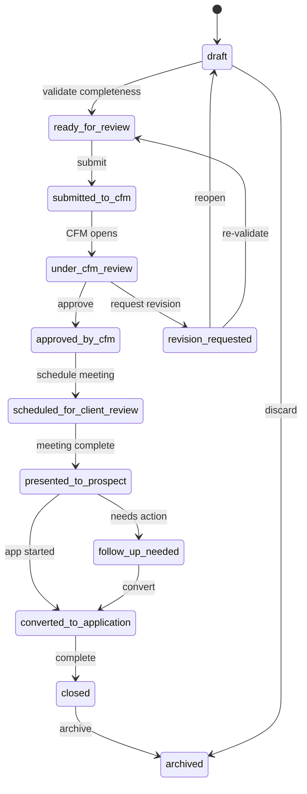
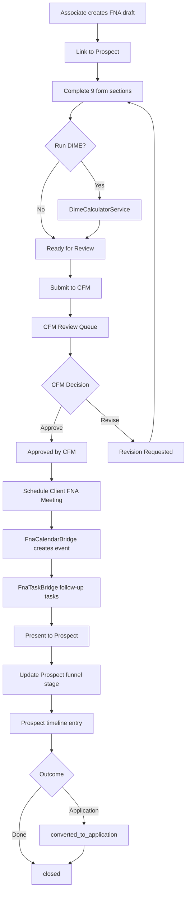
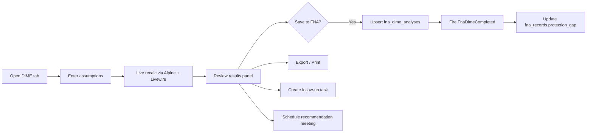
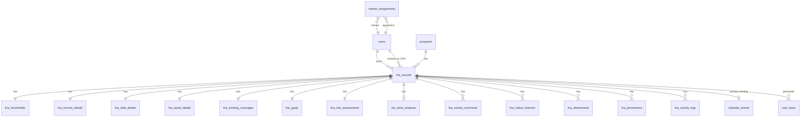

# EFGTrack — FNA Management Module
**Architecture & Design Document v1.0**

**Stack:** Laravel 12+, Livewire 3, Alpine.js, Tailwind CSS, Breeze, Spatie Permission, MySQL  
**Theme:** Premium black `#0B1F3A`, gold `#8A6A1F` / `#C8A24A`, cream `#FFF4CF` / `#FFF9EA`  
**Status:** Design only — no implementation code  
**Aligned with:** Prospect Management (`app/Services/Prospects/*`), Task Management (`UserTask`), Calendar Module (`CalendarEvent`, `ProspectCalendarBridge`), CFM mentorship (`mentor_assignments`)

---

## 0. Codebase Alignment Summary

| Existing artifact | Relevance to FNA module |
|---|---|
| `prospects.fna_status` + `config('prospects.fna_statuses')` | Legacy 4-value summary field (`not_started`, `scheduled`, `completed`, `declined`); FNA module becomes source of truth and syncs denormalized summary |
| `appointment_types` slug `financial-needs-analysis` | Prospect appointment type for FNA meetings |
| `ProspectCalendarBridge` | Pattern for `FnaCalendarBridge` (push/pull calendar events) |
| `ProspectTaskBridge` | Pattern for `FnaTaskBridge` (`related_module`, `related_prospect_id`) |
| `ProspectPolicy` + `AuthorizesProspectAccess` | Pattern for `FnaPolicy` + `AuthorizesFnaAccess` |
| `mentor_assignments` (mentor_id ↔ apprentice_id) | CFM access to trainee FNA records |
| `DownlineHierarchyService` | Agency Owner / team-leader scoped reporting |
| Migration convention `0000_00_00_0000NN_*.php` | Next: `000041`, `000042`, … |
| Navigation group "My Team" | Add FNA entry beside Prospect Management |

---

## 1. Module Architecture

### 1.1 Purpose

Enable associates to learn, prepare, complete, and submit Financial Needs Analysis (FNA) records with DIME analysis; enable CFMs to review/coach; enable Agency Owners to monitor development metrics — all integrated with Prospects, Calendar, Tasks, and Dashboard.

### 1.2 Layered Architecture

```
┌─────────────────────────────────────────────────────────────────────────┐
│  Presentation: Blade shells + Livewire 3 + Alpine.js + Tailwind         │
│  resources/views/team/fna/*.blade.php                                   │
│  app/Livewire/Fna/*                                                     │
└─────────────────────────────────────────────────────────────────────────┘
                                    │
┌─────────────────────────────────────────────────────────────────────────┐
│  Application: Controllers (page shells), Form Requests, Policies        │
│  app/Http/Controllers/FnaManagementController.php                         │
└─────────────────────────────────────────────────────────────────────────┘
                                    │
┌─────────────────────────────────────────────────────────────────────────┐
│  Domain Services: FnaRecordService, FnaWorkflowService, DimeCalculator   │
│  FnaReviewService, FnaAnalyticsService, FnaProspectBridge,               │
│  FnaCalendarBridge, FnaTaskBridge, FnaCompletenessService                │
└─────────────────────────────────────────────────────────────────────────┘
                                    │
┌─────────────────────────────────────────────────────────────────────────┐
│  Integration: Events, Listeners, Jobs, Notifications                       │
│  app/Events/Fna/* · app/Listeners/Fna/* · app/Jobs/Fna/*                │
└─────────────────────────────────────────────────────────────────────────┘
                                    │
┌─────────────────────────────────────────────────────────────────────────┐
│  Persistence: 14 FNA tables + extensions to calendar_events, user_tasks │
└─────────────────────────────────────────────────────────────────────────┘
```

### 1.3 Directory Structure

```
app/
├── Http/
│   ├── Controllers/FnaManagementController.php
│   └── Requests/Fna/
│       ├── StoreFnaRecordRequest.php
│       ├── UpdateFnaRecordRequest.php
│       ├── SubmitFnaForReviewRequest.php
│       └── ReviewFnaRequest.php
├── Livewire/Fna/
│   ├── FnaDashboard.php
│   ├── FnaIndex.php
│   ├── FnaCreate.php
│   ├── FnaEdit.php
│   ├── FnaShow.php
│   ├── FnaWizard.php
│   ├── Steps/
│   │   ├── FnaClientInfoStep.php
│   │   ├── FnaHouseholdStep.php
│   │   ├── FnaIncomeStep.php
│   │   ├── FnaDebtStep.php
│   │   ├── FnaAssetsStep.php
│   │   ├── FnaInsuranceStep.php
│   │   ├── FnaGoalsStep.php
│   │   ├── FnaRiskStep.php
│   │   └── FnaSummaryStep.php
│   ├── DimeCalculator.php
│   ├── DimeResultPanel.php
│   ├── FnaSubmitForReviewModal.php
│   ├── FnaReviewPanel.php
│   ├── CfmFnaReviewQueue.php
│   ├── AgencyOwnerFnaReports.php
│   ├── FnaCalendarScheduler.php
│   ├── FnaTaskCreator.php
│   ├── FnaNotesTimeline.php
│   └── FnaExportPreview.php
├── Models/
│   ├── FnaRecord.php
│   ├── FnaHousehold.php
│   ├── FnaIncomeDetail.php
│   ├── FnaDebtDetail.php
│   ├── FnaAssetDetail.php
│   ├── FnaExistingCoverage.php
│   ├── FnaGoal.php
│   ├── FnaRiskAssessment.php
│   ├── FnaDimeAnalysis.php
│   ├── FnaReviewComment.php
│   ├── FnaStatusHistory.php
│   ├── FnaAttachment.php
│   ├── FnaPermission.php
│   └── FnaActivityLog.php
├── Policies/
│   ├── FnaRecordPolicy.php
│   └── Concerns/AuthorizesFnaAccess.php
├── Services/Fna/
│   ├── FnaRecordService.php
│   ├── FnaWorkflowService.php
│   ├── FnaCompletenessService.php
│   ├── DimeCalculatorService.php
│   ├── FnaReviewService.php
│   ├── FnaAnalyticsService.php
│   ├── FnaProspectBridge.php
│   ├── FnaCalendarBridge.php
│   ├── FnaTaskBridge.php
│   └── FnaExportService.php
├── Events/Fna/
│   ├── FnaCreated.php
│   ├── FnaSubmittedForReview.php
│   ├── FnaStatusChanged.php
│   ├── FnaApproved.php
│   ├── FnaRevisionRequested.php
│   ├── FnaDimeCompleted.php
│   └── FnaMeetingScheduled.php
├── Listeners/Fna/
│   ├── SyncProspectFnaStatus.php
│   ├── CreateFnaWorkflowTasks.php
│   ├── LogFnaActivity.php
│   ├── NotifyCfmOfFnaSubmission.php
│   ├── NotifyAssociateOfFnaReview.php
│   ├── SyncFnaCalendarEvent.php
│   └── UpdateProspectStageAfterFna.php
├── Jobs/Fna/
│   ├── RollupFnaAnalytics.php
│   ├── SendFnaReviewReminders.php
│   └── ArchiveStaleFnaDrafts.php
├── Notifications/Fna/
│   ├── FnaSubmittedNotification.php
│   ├── FnaApprovedNotification.php
│   └── FnaRevisionRequestedNotification.php
└── DTOs/Fna/
    ├── DimeCalculationResult.php
    └── FnaCompletenessReport.php

config/fna.php                          # statuses, transitions, task templates, DIME defaults
database/migrations/
├── 0000_00_00_000041_create_fna_management_tables.php
├── 0000_00_00_000042_add_fna_links_to_calendar_and_tasks.php
└── 0000_00_00_000043_create_fna_analytics_snapshots_table.php
database/seeders/FnaLookupSeeder.php
resources/views/team/fna/
├── dashboard.blade.php
├── index.blade.php
├── create.blade.php
├── show.blade.php
├── wizard.blade.php
├── dime-calculator.blade.php
├── cfm-review-queue.blade.php
└── agency-reports.blade.php
resources/views/livewire/fna/           # mirrors Livewire component names
tests/Feature/Fna/
tests/Unit/Fna/
docs/FNA_MANAGEMENT_ARCHITECTURE.md     # this document (persisted in Phase 1)
```

### 1.4 Service Class List

| Service | Responsibility |
|---|---|
| `FnaRecordService` | CRUD, section upserts, draft autosave, prospect prefill |
| `FnaWorkflowService` | Status transitions, validation gates, history writes |
| `FnaCompletenessService` | Required-field scoring, missing-field indicators for CFM queue |
| `DimeCalculatorService` | Pure calculation: debt, income, mortgage, education, gap |
| `FnaReviewService` | CFM approve/revision, comment threads, review SLA metrics |
| `FnaAnalyticsService` | Dashboard widgets, agency reports, rollups (mirrors `ProspectAnalyticsService`) |
| `FnaProspectBridge` | Link/unlink prospect, sync `prospects.fna_status`, timeline entries, stage moves |
| `FnaCalendarBridge` | Create/update/cancel calendar events (mirrors `ProspectCalendarBridge`) |
| `FnaTaskBridge` | Auto/manual task creation (mirrors `ProspectTaskBridge`) |
| `FnaExportService` | PDF/print summary, DIME export |

### 1.5 Route Structure

Register in `routes/web.php` inside authenticated middleware group, mirroring prospect routes:

```php
Route::prefix('team/fna')->name('team.fna.')->group(function () {
    // Associate + shared access
    Route::middleware('permission:manage fna records')->group(function () {
        Route::get('/', [FnaManagementController::class, 'dashboard'])->name('dashboard');
        Route::get('/records', [FnaManagementController::class, 'index'])->name('index');
        Route::get('/records/create', [FnaManagementController::class, 'create'])->name('create');
        Route::get('/records/{fnaRecord}', [FnaManagementController::class, 'show'])->name('show');
        Route::get('/records/{fnaRecord}/edit', [FnaManagementController::class, 'edit'])->name('edit');
        Route::get('/records/{fnaRecord}/wizard', [FnaManagementController::class, 'wizard'])->name('wizard');
        Route::get('/dime-calculator', [FnaManagementController::class, 'dimeCalculator'])->name('dime');
        Route::get('/records/{fnaRecord}/export', [FnaManagementController::class, 'export'])
            ->middleware('permission:export fna records')->name('export');
    });

    // CFM review
    Route::get('/cfm/review-queue', [FnaManagementController::class, 'cfmReviewQueue'])
        ->middleware('permission:review trainee fna records')->name('cfm.review-queue');

    // Agency Owner reports
    Route::get('/reports/agency', [FnaManagementController::class, 'agencyReports'])
        ->middleware('permission:view fna agency reports')->name('reports.agency');
});

// Prospect profile integration (nested under existing prospect routes)
Route::get('/team/prospects/records/{prospect}/fna', [FnaManagementController::class, 'prospectFnas'])
    ->middleware('permission:manage prospects')->name('team.prospects.records.fna');
```

**Navigation entry** (in `resources/views/layouts/navigation.blade.php`, "My Team" group):

```php
['label' => 'FNA Management', 'route' => 'team.fna.dashboard', 'permissions' => ['manage fna records']],
```

---

## 2. User Roles and Permissions (Spatie)

### 2.1 New Permissions

Add to `RolePermissionSeeder`:

| Permission | Description |
|---|---|
| `manage fna records` | Create/edit own FNA drafts; view own records |
| `view shared fna records` | View FNAs explicitly shared or mentor-visible |
| `submit fna for review` | Transition draft → submitted |
| `review trainee fna records` | CFM review queue, approve, request revision |
| `view fna agency reports` | Agency Owner aggregate reports (limited PII) |
| `view fna financial details` | View sensitive financial sections |
| `export fna records` | PDF/print export |
| `manage fna settings` | Admin config (DIME defaults, required fields) |

### 2.2 Role Matrix

| Permission | new-recruit | associate | member | CFM | team-leader | agency-owner | admin | super-admin |
|---|:---:|:---:|:---:|:---:|:---:|:---:|:---:|:---:|
| `manage fna records` | ✅ | ✅ | ✅ | ✅* | ✅ | ✅† | ✅ | ✅ |
| `view shared fna records` | ✅ | ✅ | ✅ | ✅ | ✅ | ✅ | ✅ | ✅ |
| `submit fna for review` | ✅ | ✅ | ✅ | — | ✅ | — | ✅ | ✅ |
| `review trainee fna records` | — | — | — | ✅ | ✅‡ | ✅‡ | ✅ | ✅ |
| `view fna agency reports` | — | — | — | — | ✅ | ✅ | ✅ | ✅ |
| `view fna financial details` | ✅ own | ✅ own | ✅ own | ✅ trainee | ✅ team | ⚠ limited | ✅ | ✅ |
| `export fna records` | ✅ own | ✅ own | ✅ own | ✅ trainee | ✅ team | ✅ agg | ✅ | ✅ |
| `manage fna settings` | — | — | — | — | — | — | ✅ | ✅ |

\* CFM can create FNAs for coaching demos but typically reviews trainee submissions.  
† Agency Owner sees own + hierarchy summaries.  
‡ Optional coaching override; primary CFM access via `mentor_assignments`.  
⚠ Agency Owner sees aggregates + masked financials unless `view fna financial details` granted per policy.

---

## 3. Privacy Rules and Policies

### 3.1 Default Privacy Model

1. **Owner-only by default** — `fna_records.owner_user_id` is the associate who created the record.
2. **CFM access** — Active `mentor_assignments` where `mentor_id = CFM` and `apprentice_id = owner_user_id` grants review access once status ≥ `submitted_to_cfm`.
3. **Explicit shares** — `fna_permissions` table (mirrors `prospect_shares` pattern) for sponsor/manager grants.
4. **Agency Owner** — Sees summary metrics via `DownlineHierarchyService`; detail view requires `view fna financial details` AND record in hierarchy.
5. **Super Admin / Admin** — Full access.

### 3.2 `FnaRecordPolicy` (pseudocode)

```php
trait AuthorizesFnaAccess {
    protected function canAccessFna(User $user, FnaRecord $fna, ?string $flag = null): bool
    {
        if ($user->hasAnyRole(['super-admin', 'admin'])) return true;
        if ((int) $fna->owner_user_id === $user->id) return true;

        // CFM trainee access (review states only unless collaborate flag)
        if ($user->hasRole('certified-field-mentor') && $this->isAssignedCfm($user, $fna)) {
            if ($fna->status === 'draft' && ! $flag) return false; // drafts private
            return true;
        }

        // Explicit fna_permissions grant
        $grant = $fna->permissions()->activeFor($user)->first();
        if ($grant && (!$flag || $grant->allows($flag))) return true;

        // Agency Owner hierarchy summary-only handled at controller level
        return false;
    }
}
```

### 3.3 Sensitive Field Masking

For Agency Owner reports without financial detail permission:

- Show: status, dates, DIME completed yes/no, protection gap range bucket (`<250k`, `250k–500k`, `500k+`), associate name, CFM name.
- Hide: income amounts, debt balances, beneficiary names, policy numbers.

### 3.4 Audit Trail

Every view of financial sections by non-owner logged to `fna_activity_logs` with `action = viewed_financial_details`.

---

## 4. FNA Status Workflow (12 Statuses)

### 4.1 Status Definitions

| Slug | Label | Owner | Description |
|---|---|---|---|
| `draft` | Draft | Associate | In progress; editable |
| `ready_for_review` | Ready for Review | Associate | Self-validated; not yet submitted to CFM |
| `submitted_to_cfm` | Submitted to CFM | Associate | Awaiting CFM pickup |
| `under_cfm_review` | Under CFM Review | CFM | CFM actively reviewing |
| `revision_requested` | Revision Requested | CFM | Returned to associate with feedback |
| `approved_by_cfm` | Approved by CFM | CFM | Cleared for client presentation |
| `scheduled_for_client_review` | Scheduled for Client Review | Associate | Calendar event linked |
| `presented_to_prospect` | Presented to Prospect | Associate | Client meeting completed |
| `follow_up_needed` | Follow-Up Needed | Associate | Post-presentation action required |
| `converted_to_application` | Converted to Application | Associate | Linked to application stage |
| `closed` | Closed | Associate/CFM | Terminal success |
| `archived` | Archived | Associate/Admin | Terminal inactive |

Store in `config/fna.php` (extend pattern of `config/prospects.php`).

### 4.2 Status Transition Table

| From → To | Actor | Guard / Condition |
|---|---|---|
| `draft` → `ready_for_review` | Owner | Completeness ≥ configurable threshold |
| `ready_for_review` → `submitted_to_cfm` | Owner | Required sections complete; CFM assigned |
| `submitted_to_cfm` → `under_cfm_review` | CFM | CFM opens review |
| `under_cfm_review` → `approved_by_cfm` | CFM | Review checklist complete |
| `under_cfm_review` → `revision_requested` | CFM | Comment required |
| `revision_requested` → `draft` | Owner | Auto on open for edit |
| `revision_requested` → `ready_for_review` | Owner | Re-validated |
| `approved_by_cfm` → `scheduled_for_client_review` | Owner | Calendar event created |
| `scheduled_for_client_review` → `presented_to_prospect` | Owner | Meeting marked complete |
| `presented_to_prospect` → `follow_up_needed` | Owner/Auto | No next action within N days |
| `presented_to_prospect` → `converted_to_application` | Owner | Prospect stage = application-submitted |
| `follow_up_needed` → `converted_to_application` | Owner | Manual |
| `*` → `closed` | Owner/CFM | Business complete |
| `*` → `archived` | Owner/Admin | Soft archive |
| `archived` → `draft` | Admin only | Restore |

Invalid transitions throw `InvalidFnaStatusTransitionException` in `FnaWorkflowService`.

### 4.3 Workflow Diagram



### 4.4 End-to-End Workflow Diagram



### 4.5 Sync with `prospects.fna_status`

Denormalized mapping on every `FnaStatusChanged`:

| FNA canonical status | `prospects.fna_status` |
|---|---|
| `draft`, `ready_for_review`, `revision_requested` | `not_started` |
| `submitted_to_cfm`, `under_cfm_review` | `not_started` (or new value `in_review` — optional migration) |
| `approved_by_cfm`, `scheduled_for_client_review` | `scheduled` |
| `presented_to_prospect`, `follow_up_needed`, `converted_to_application`, `closed` | `completed` |
| `archived` + declined flag | `declined` |

Implement in `FnaProspectBridge::syncProspectFnaStatus()`.

---

## 5. DIME Analysis Workflow

### 5.1 DIME Components

| Letter | Inputs | Calculation |
|---|---|---|
| **D** Debt | Credit cards, personal/car/student/business loans, final expenses, other | `total_debt = SUM(inputs)` |
| **I** Income | Annual income, years to replace, inflation %, existing coverage | `income_need = annual × years × (1 + inflation)^years − existing` |
| **M** Mortgage | Balance, years remaining, monthly payment, include payoff toggle | `mortgage_need = include ? balance : 0` |
| **E** Education | # children, cost/child, years to college, inflation, existing savings | `education_need = Σ adjusted cost − savings` |

**Total DIME need** = D + I + M + E  
**Protection gap** = total_dime_need − existing_life_insurance − liquid_assets_allocated  
**Recommended range** = `[gap × 0.9, gap × 1.1]` (configurable)

### 5.2 DIME Workflow



### 5.3 Disclaimer (required on every DIME view)

> *This analysis is for educational and planning purposes only and should not be considered a final recommendation. Product suitability and recommendations must follow applicable compliance, licensing, and company guidelines.*

Display in `DimeCalculator` footer and export PDF footer.

### 5.4 DIME Config Defaults (`config/fna.php`)

```php
'dime_defaults' => [
    'income_replacement_years' => 10,
    'inflation_rate' => 0.03,
    'education_inflation_rate' => 0.05,
    'education_cost_per_child' => 100000,
    'coverage_range_multiplier' => [0.9, 1.1],
],
```

---

## 6. Full Database Schema

**Migration:** `0000_00_00_000041_create_fna_management_tables.php`  
**Convention:** ULID primary key on `fna_records` (matches `prospects.id`); BIGINT PKs on child tables; soft deletes on main entities; timestamps everywhere.

### 6.1 `fna_records` (master)

| Column | Type | Notes |
|---|---|---|
| `id` | ULID PK | |
| `owner_user_id` | FK users | Associate owner |
| `created_by_user_id` | FK users | May differ if CFM initiates |
| `cfm_user_id` | FK users NULL | Resolved from mentor_assignments on submit |
| `prospect_id` | FK prospects NULL | ULID |
| `calendar_event_id` | FK calendar_events NULL | Primary client meeting |
| `status` | VARCHAR(40) | Indexed |
| `title` | VARCHAR(255) | Auto: "{Prospect Name} FNA" |
| `reference_code` | VARCHAR(20) UNIQUE | Human-readable FNA-2026-0001 |
| `current_step` | TINYINT | Wizard progress 1–9 |
| `completeness_score` | TINYINT | 0–100 |
| `dime_completed` | BOOLEAN | |
| `protection_gap` | DECIMAL(14,2) NULL | Cached from DIME |
| `recommended_coverage_min` | DECIMAL(14,2) NULL | |
| `recommended_coverage_max` | DECIMAL(14,2) NULL | |
| `client_name` | VARCHAR(255) | |
| `client_email` | VARCHAR(255) NULL | |
| `client_phone` | VARCHAR(60) NULL | |
| `date_of_birth` | DATE NULL | |
| `age` | TINYINT NULL | Computed/cached |
| `gender` | VARCHAR(30) NULL | |
| `marital_status` | VARCHAR(30) NULL | |
| `occupation` | VARCHAR(120) NULL | |
| `employer_business` | VARCHAR(255) NULL | |
| `city` | VARCHAR(120) NULL | |
| `state_province` | VARCHAR(120) NULL | |
| `country` | VARCHAR(120) NULL | |
| `preferred_contact_method` | VARCHAR(40) NULL | |
| `best_contact_time` | VARCHAR(120) NULL | |
| `main_needs_identified` | TEXT NULL | Summary section |
| `recommended_next_action` | TEXT NULL | |
| `follow_up_date` | DATE NULL | |
| `associate_recommendation` | TEXT NULL | |
| `cfm_feedback_summary` | TEXT NULL | |
| `summary_notes` | TEXT NULL | |
| `submitted_at` | TIMESTAMP NULL | Indexed |
| `approved_at` | TIMESTAMP NULL | |
| `presented_at` | TIMESTAMP NULL | |
| `closed_at` | TIMESTAMP NULL | |
| `deleted_at` | TIMESTAMP NULL | Soft delete |
| `created_at`, `updated_at` | TIMESTAMP | |

**Indexes:** `(owner_user_id, status)`, `(cfm_user_id, status)`, `(prospect_id)`, `(submitted_at)`, `(status, deleted_at)`.

### 6.2 `fna_households` (1:1)

| Column | Type |
|---|---|
| `id` | BIGINT PK |
| `fna_record_id` | FK fna_records UNIQUE |
| `spouse_partner_name` | VARCHAR(255) NULL |
| `spouse_partner_age` | TINYINT NULL |
| `children_count` | TINYINT NULL |
| `children_details` | JSON NULL | `[{name, age}]` |
| `dependents_notes` | TEXT NULL |
| `household_income` | DECIMAL(14,2) NULL |
| `household_expenses` | DECIMAL(14,2) NULL |
| `financial_priorities` | JSON NULL | Multi-select keys |
| timestamps | |

### 6.3 `fna_income_details` (1:1)

| Column | Type |
|---|---|
| `id` | BIGINT PK |
| `fna_record_id` | FK UNIQUE |
| `annual_income` | DECIMAL(14,2) NULL |
| `monthly_income` | DECIMAL(14,2) NULL |
| `spouse_annual_income` | DECIMAL(14,2) NULL |
| `other_income_sources` | JSON NULL |
| `business_income` | DECIMAL(14,2) NULL |
| `passive_income` | DECIMAL(14,2) NULL |
| `expected_income_changes` | TEXT NULL |
| timestamps | |

### 6.4 `fna_debt_details` (1:1)

| Column | Type |
|---|---|
| `id` | BIGINT PK |
| `fna_record_id` | FK UNIQUE |
| `mortgage_balance` | DECIMAL(14,2) NULL |
| `rent_amount` | DECIMAL(14,2) NULL |
| `credit_card_debt` | DECIMAL(14,2) NULL |
| `car_loans` | DECIMAL(14,2) NULL |
| `student_loans` | DECIMAL(14,2) NULL |
| `personal_loans` | DECIMAL(14,2) NULL |
| `business_debt` | DECIMAL(14,2) NULL |
| `other_liabilities` | DECIMAL(14,2) NULL |
| `total_debt` | DECIMAL(14,2) NULL | Cached |
| timestamps | |

### 6.5 `fna_asset_details` (1:1)

| Column | Type |
|---|---|
| `id` | BIGINT PK |
| `fna_record_id` | FK UNIQUE |
| `emergency_fund` | DECIMAL(14,2) NULL |
| `checking_savings` | DECIMAL(14,2) NULL |
| `retirement_accounts` | DECIMAL(14,2) NULL |
| `investment_accounts` | DECIMAL(14,2) NULL |
| `real_estate_assets` | DECIMAL(14,2) NULL |
| `business_assets` | DECIMAL(14,2) NULL |
| `college_savings` | DECIMAL(14,2) NULL |
| `other_assets` | DECIMAL(14,2) NULL |
| `total_assets` | DECIMAL(14,2) NULL | Cached |
| timestamps | |

### 6.6 `fna_existing_coverages` (1:1)

| Column | Type |
|---|---|
| `id` | BIGINT PK |
| `fna_record_id` | FK UNIQUE |
| `existing_life_insurance_amount` | DECIMAL(14,2) NULL |
| `term_coverage` | DECIMAL(14,2) NULL |
| `whole_life_coverage` | DECIMAL(14,2) NULL |
| `universal_life_coverage` | DECIMAL(14,2) NULL |
| `group_insurance_coverage` | DECIMAL(14,2) NULL |
| `disability_coverage` | DECIMAL(14,2) NULL |
| `critical_illness_coverage` | DECIMAL(14,2) NULL |
| `long_term_care_coverage` | DECIMAL(14,2) NULL |
| `beneficiary_information` | TEXT NULL |
| `policy_review_needed` | BOOLEAN DEFAULT false |
| timestamps | |

### 6.7 `fna_goals` (1:1)

| Column | Type |
|---|---|
| `id` | BIGINT PK |
| `fna_record_id` | FK UNIQUE |
| `selected_goals` | JSON | Keys: income_protection, mortgage_protection, final_expense, education_funding, retirement_planning, wealth_building, debt_elimination, estate_planning, business_continuation, tax_strategies, legacy_planning |
| `goal_notes` | TEXT NULL |
| timestamps | |

### 6.8 `fna_risk_assessments` (1:1)

| Column | Type |
|---|---|
| `id` | BIGINT PK |
| `fna_record_id` | FK UNIQUE |
| `main_financial_concern` | TEXT NULL |
| `health_considerations` | TEXT NULL |
| `job_stability` | VARCHAR(40) NULL | stable/moderate/at_risk |
| `family_dependency_level` | VARCHAR(40) NULL | low/medium/high |
| `emergency_fund_adequacy` | VARCHAR(40) NULL | adequate/partial/inadequate |
| `current_protection_gap` | TEXT NULL |
| `risk_tolerance` | VARCHAR(40) NULL | conservative/moderate/aggressive |
| `urgency_level` | VARCHAR(40) NULL | low/medium/high/urgent |
| timestamps | |

### 6.9 `fna_dime_analyses` (1:1, versioned optional)

| Column | Type |
|---|---|
| `id` | BIGINT PK |
| `fna_record_id` | FK UNIQUE |
| `debt_inputs` | JSON | All D debt fields |
| `total_debt` | DECIMAL(14,2) | |
| `income_annual_to_replace` | DECIMAL(14,2) NULL | |
| `income_years_to_replace` | SMALLINT NULL | |
| `income_inflation_adjustment` | BOOLEAN DEFAULT true | |
| `existing_income_replacement_coverage` | DECIMAL(14,2) NULL | |
| `total_income_need` | DECIMAL(14,2) NULL | |
| `mortgage_balance` | DECIMAL(14,2) NULL | |
| `mortgage_years_remaining` | SMALLINT NULL | |
| `monthly_mortgage_payment` | DECIMAL(14,2) NULL | |
| `include_mortgage_payoff` | BOOLEAN DEFAULT true | |
| `total_mortgage_need` | DECIMAL(14,2) NULL | |
| `education_children_count` | TINYINT NULL | |
| `education_cost_per_child` | DECIMAL(14,2) NULL | |
| `education_years_to_college` | SMALLINT NULL | |
| `education_inflation_adjustment` | BOOLEAN DEFAULT true | |
| `existing_education_savings` | DECIMAL(14,2) NULL | |
| `total_education_need` | DECIMAL(14,2) NULL | |
| `total_dime_need` | DECIMAL(14,2) | |
| `existing_life_insurance` | DECIMAL(14,2) NULL | |
| `liquid_assets_allocated` | DECIMAL(14,2) NULL | |
| `estimated_protection_gap` | DECIMAL(14,2) | |
| `recommended_coverage_min` | DECIMAL(14,2) NULL | |
| `recommended_coverage_max` | DECIMAL(14,2) NULL | |
| `notes` | TEXT NULL | |
| `calculated_at` | TIMESTAMP | |
| timestamps | |

### 6.10 `fna_review_comments`

| Column | Type |
|---|---|
| `id` | BIGINT PK |
| `fna_record_id` | FK | Indexed |
| `user_id` | FK | CFM or associate |
| `comment_type` | VARCHAR(40) | coaching, revision, approval, internal |
| `body` | TEXT | |
| `is_internal` | BOOLEAN | CFM-only notes |
| `created_at`, `updated_at` | | |

### 6.11 `fna_status_histories`

| Column | Type |
|---|---|
| `id` | BIGINT PK |
| `fna_record_id` | FK | Indexed |
| `from_status` | VARCHAR(40) NULL | |
| `to_status` | VARCHAR(40) | |
| `changed_by_user_id` | FK users | |
| `change_source` | VARCHAR(40) | manual, automation, system |
| `metadata` | JSON NULL | |
| `created_at` | TIMESTAMP | |

### 6.12 `fna_attachments`

| Column | Type |
|---|---|
| `id` | BIGINT PK |
| `fna_record_id` | FK | |
| `uploaded_by_user_id` | FK | |
| `disk` | VARCHAR(40) | local/s3 |
| `path` | VARCHAR(255) | |
| `original_name` | VARCHAR(255) | |
| `mime_type` | VARCHAR(120) NULL | |
| `size_bytes` | UNSIGNED INT | |
| `category` | VARCHAR(60) NULL | policy, id, worksheet |
| timestamps, soft deletes | |

### 6.13 `fna_permissions`

| Column | Type |
|---|---|
| `id` | BIGINT PK |
| `fna_record_id` | FK | |
| `granted_by_user_id` | FK | |
| `shared_with_user_id` | FK | |
| `permission_level` | VARCHAR(40) | view, collaborate, review |
| `can_view_financial_details` | BOOLEAN | |
| `status` | VARCHAR(20) | active, revoked |
| `granted_at` | TIMESTAMP | |
| `revoked_at` | TIMESTAMP NULL | |
| `expires_at` | TIMESTAMP NULL | |
| timestamps | |

Unique: `(fna_record_id, shared_with_user_id, status)`.

### 6.14 `fna_activity_logs`

| Column | Type |
|---|---|
| `id` | BIGINT PK |
| `fna_record_id` | FK | Indexed |
| `user_id` | FK NULL | |
| `action` | VARCHAR(60) | created, updated, submitted, approved, viewed_financial_details, dime_calculated, … |
| `description` | TEXT NULL | |
| `metadata` | JSON NULL | |
| `ip_address` | VARCHAR(45) NULL | |
| `created_at` | TIMESTAMP | Indexed |

### 6.15 Extension Tables (Migration `000042`)

**`calendar_events`** — add:

```sql
related_fna_id ULID NULL FK fna_records
INDEX (related_fna_id)
```

**`user_tasks`** — add:

```sql
related_fna_id ULID NULL FK fna_records
category enum extended: 'FNA' added to UserTask::CATEGORIES
related_module value: 'fna'
INDEX (related_fna_id)
```

**`fna_analytics_snapshots`** (Migration `000043`, optional rollup):

```sql
id, user_id, snapshot_date, metric_key, value DECIMAL(14,2), metadata JSON
UNIQUE (user_id, snapshot_date, metric_key)
```

### 6.16 Calendar Event Types (Seeder)

Add to `CalendarModuleSeeder`:

| Name | Slug | Category |
|---|---|---|
| FNA Review with CFM | `fna-cfm-review` | prospects |
| Client FNA Meeting | `fna-client-meeting` | prospects |
| Financial Review | `fna-financial-review` | prospects |
| Protection Gap Review | `fna-protection-gap-review` | prospects |
| FNA Follow-Up | `fna-follow-up` | prospects |
| Policy Review | `fna-policy-review` | prospects |

---

## 7. Eloquent Model Relationships



**`FnaRecord` key relationships:**

```php
// Pseudocode — not implementation
belongsTo: owner, creator, cfm, prospect, calendarEvent
hasOne: household, incomeDetail, debtDetail, assetDetail, existingCoverage, goals, riskAssessment, dimeAnalysis
hasMany: reviewComments, statusHistories, attachments, permissions, activityLogs, tasks
```

---

## 8. Livewire Component Structure

| Component | Responsibility |
|---|---|
| `FnaDashboard` | Stat cards, widgets, quick actions, weekly meetings |
| `FnaIndex` | Table/card toggle, filters, search, pagination |
| `FnaCreate` | Quick create shell; redirects to wizard |
| `FnaEdit` | Single-page edit alternative to wizard |
| `FnaShow` | Read-only detail with tabs: sections, DIME, review, timeline |
| `FnaWizard` | Orchestrator: step nav, progress bar, save draft, submit |
| `FnaClientInfoStep` | Section 1 fields; prospect prefill |
| `FnaHouseholdStep` | Section 2 |
| `FnaIncomeStep` | Section 3 |
| `FnaDebtStep` | Section 4 |
| `FnaAssetsStep` | Section 5 |
| `FnaInsuranceStep` | Section 6 |
| `FnaGoalsStep` | Section 7 multi-select goals |
| `FnaRiskStep` | Section 8 |
| `FnaSummaryStep` | Section 9 + completeness indicator |
| `DimeCalculator` | Standalone + embedded tab; live calc |
| `DimeResultPanel` | Gap chart, range display, disclaimers |
| `FnaSubmitForReviewModal` | Validation summary, CFM confirm, submit action |
| `FnaReviewPanel` | CFM inline review on show page |
| `CfmFnaReviewQueue` | Queue table with missing-fields badge |
| `AgencyOwnerFnaReports` | Hierarchy charts, approval rates |
| `FnaCalendarScheduler` | Create calendar event from approved FNA |
| `FnaTaskCreator` | Manual task creation with templates |
| `FnaNotesTimeline` | Activity + review comments chronology |
| `FnaExportPreview` | Print-friendly layout before PDF |

**Livewire patterns** (match Prospect module):

- `$this->authorize()` in `mount()`
- `#[On('fna-refresh')]` for cross-component updates
- `wire:model.live.debounce.500ms` on wizard fields for autosave
- Flash via `session()->flash('fna_status', ...)`

---

## 9. UI/UX Page Specifications

### 9.1 Shared Layout Tokens

| Element | Tailwind classes |
|---|---|
| Page hero | `bg-[#0B1F3A] px-6 py-6 text-white` |
| Primary CTA | `border border-[#C8A24A] bg-[#C8A24A] text-[#0B1F3A] hover:bg-[#D8B85F]` |
| Secondary CTA | `bg-[#0B1F3A] text-white hover:bg-[#12345B]` |
| Section headings | `text-lg font-semibold text-[#0B1F3A]` |
| Gold links | `text-[#8A6A1F] hover:text-[#0B1F3A]` |
| Count badges | `border border-[#C8A24A] bg-[#FFF4CF] text-[#0B1F3A]` |
| Cards | `rounded-xl border border-slate-200 bg-white shadow-sm` |
| Expand toggles | Alpine `x-data="{ expanded: true }"` (match `prospects.blade.php`) |

### 9.2 Page 1 — FNA Dashboard (`/team/fna`)

**Layout:** 2-column responsive grid.

**Hero:** "FNA Management" eyebrow + `[+ New FNA]` + `[DIME Calculator]`.

**Stat row (4 cards):**

- Total FNAs
- Draft FNAs
- Awaiting CFM Review (`submitted_to_cfm` + `under_cfm_review`)
- Approved FNAs

**Widget grid:**

| Widget | Position | Alpine behavior |
|---|---|---|
| FNA Completion Progress | Left col | Donut chart; `expanded` toggle |
| FNAs Awaiting CFM Review | Left | List with deep links |
| Revision Requested | Left | Red-accent badge list |
| FNA Meetings This Week | Right | Pulls calendar events `related_fna_id` |
| DIME Analyses Completed | Right | Count + trend |
| Average Coverage Gap | Right | `$XXX,XXX` formatted |
| Prospect Conversion After FNA | Right | % from analytics |
| CFM Review Time Average | CFM/Owner only | Hours metric |

### 9.3 Page 2 — My FNAs (`/team/fna/records`)

**Toolbar:** Search input, view toggle (table/cards), filter drawer.

**Table columns:** Reference, Client/Prospect, Status badge, DIME ✓/—, CFM, Protection Gap, Updated, Actions.

**Status badges:**

| Status | Color |
|---|---|
| draft | slate |
| submitted/under review | amber |
| revision_requested | red |
| approved | green |
| scheduled | blue |
| closed/archived | gray |

**Card view:** Gold top border, prospect link, gap summary, quick actions.

### 9.4 Page 3 — FNA Wizard (`/team/fna/records/{id}/wizard`)

**Header:** Progress stepper (9 steps + DIME tab + CFM Feedback tab).

**Stepper:** Gold fill for completed, navy for current, gray for pending.

**Footer actions:** `[Save Draft]` `[Previous]` `[Next]` `[Submit for Review]` (disabled until ready).

**Alpine:**

- `x-data="{ step: @entangle('currentStep') }"`
- Unsaved changes warning on navigation
- Mobile: collapsible step list drawer

### 9.5 Page 4 — DIME Calculator (`/team/fna/dime-calculator`)

**Layout:** 2-column — inputs left, `DimeResultPanel` sticky right.

**Sections:** Accordion for D / I / M / E with live totals.

**Protection gap chart:** Horizontal bar (existing coverage vs need) using `#C8A24A` / `#0B1F3A`.

**Actions:** `[Save to FNA]` (modal select FNA), `[Print]`, `[Create Task]`, `[Schedule Meeting]`.

### 9.6 Page 5 — CFM Review Queue (`/team/fna/cfm/review-queue`)

**Access:** CFM role + `review trainee fna records`.

**Table:** Trainee, Prospect, Submitted date, Completeness %, Missing fields chip, Protection gap, Actions.

**Review drawer:** `FnaReviewPanel` with section summaries (not full PII in list), `[Approve]` `[Request Revision]`.

**Missing fields indicator:** From `FnaCompletenessService` — e.g., "Income, DIME".

### 9.7 Page 6 — Agency Owner Reports (`/team/fna/reports/agency`)

**Scope:** `DownlineHierarchyService` members.

**Sections:**

- FNA activity by associate (bar chart)
- FNA activity by CFM (review volume)
- Approval / revision rates (dual stat cards)
- FNA appointments scheduled (count)
- Funnel conversion after FNA (prospect stage movement post-approval)

**Privacy:** Financial detail columns masked unless permitted.

### 9.8 Prospect Profile Integration Tab

Extend `ProspectProfileTabs` with tab `fna`:

- List linked FNAs
- `[Create FNA]` button (prefills from prospect)
- Quick status badges
- Link to DIME summary
- `[Schedule FNA Appointment]` dispatching `FnaCalendarScheduler`

---

## 10. Calendar Integration Points

### 10.1 `FnaCalendarBridge` (mirrors `ProspectCalendarBridge`)

**Meeting types → event type slug:**

| UI Label | Slug |
|---|---|
| FNA Review with CFM | `fna-cfm-review` |
| Client FNA Meeting | `fna-client-meeting` |
| Financial Review Appointment | `fna-financial-review` |
| Protection Gap Review | `fna-protection-gap-review` |
| Follow-Up Meeting | `fna-follow-up` |
| Policy Review Appointment | `fna-policy-review` |

**Event payload:**

```php
[
    'calendar_event_type_id' => resolved type,
    'calendar_category_id' => CalendarCategory slug 'prospects',
    'organizer_id' => associate id,
    'title' => "FNA: {type} — {client name}",
    'starts_at', 'ends_at', 'timezone',
    'location', 'meeting_link',
    'related_prospect_id' => fna.prospect_id,
    'related_fna_id' => fna.id,
    'visibility' => 'private',
]
```

**Attendees:** Associate (organizer), CFM (`cfm_user_id`), optional helper.

**Bidirectional sync:** Calendar edit updates `fna_records` status → `scheduled_for_client_review`; cancellation reverts to `approved_by_cfm`.

**Prospect appointment link:** Optionally create `prospect_appointments` row with `appointment_type` = Financial Needs Analysis and sync via existing bridge.

---

## 11. Prospect Management Integration Points

| Trigger | Action |
|---|---|
| Prospect record show | New "FNA" tab via `ProspectProfileTabs` |
| Create FNA from prospect | Prefill client info; set `prospect_id` |
| FNA approved | `FnaProspectBridge::advanceStage()` → pipeline stage "Financial Review" |
| FNA presented | Log `prospect_activities` type `financial_review` |
| FNA status change | Sync `prospects.fna_status` |
| Prospect timeline | `FnaNotesTimeline` entries via `ProspectFunnelService::logActivity()` |
| Prospect appointment hub | Show linked FNA meetings |
| Prospect funnel board | Badge on card if FNA in progress |

**Activity metadata example:**

```json
{"fna_record_id": "01J...", "action": "submitted_to_cfm", "protection_gap": 350000}
```

---

## 12. Task Management Integration Points

### 12.1 Extend `UserTask::CATEGORIES`

Add `'FNA'` alongside `'Prospect Follow-Up'`.

### 12.2 Auto-Task Templates (`config/fna.php`)

| Event | Task title | Priority | Due offset |
|---|---|---|---|
| FNA draft created | Complete FNA draft for {client} | medium | +3 days |
| Ready for review | Submit FNA to CFM for {client} | high | +1 day |
| Submitted | Review FNA: {trainee} — {client} | high | +2 days (CFM assignee) |
| Revision requested | Revise FNA for {client} | urgent | +2 days |
| Approved | Schedule client FNA review for {client} | high | +3 days |
| Meeting completed | Follow up after FNA meeting — {client} | medium | +1 day |
| DIME incomplete at submit | Complete DIME analysis for {client} | medium | +1 day |
| Attachment required | Upload required FNA documents — {client} | medium | +5 days |

### 12.3 `FnaTaskBridge` pseudocode

```php
UserTask::create([
    'assigned_to_user_id' => $assigneeId,
    'created_by_user_id' => $actor->id,
    'title' => $title,
    'category' => 'FNA',
    'related_module' => 'fna',
    'related_person' => $fna->client_name,
    'related_prospect_id' => $fna->prospect_id,
    'related_fna_id' => $fna->id,
    'priority' => $priority,
    'status' => 'to_do',
    'due_date' => $dueDate,
]);
```

Tasks appear on `/tasks` with FNA filter badge; clicking opens FNA show page.

---

## 13. Dashboard Analytics and Reports

### 13.1 Personal Dashboard Widgets (`FnaAnalyticsService::summaryFor`)

| Metric key | Calculation |
|---|---|
| `total_fnas` | Count owned active |
| `draft_fnas` | status = draft |
| `awaiting_review` | submitted + under review |
| `approved_fnas` | approved_by_cfm + beyond |
| `revision_requested` | status count |
| `dime_completed` | dime_completed = true |
| `avg_protection_gap` | AVG(protection_gap) |
| `meetings_this_week` | calendar events with related_fna_id |
| `conversion_after_fna` | prospects moved to application-submitted within 30d of approval |

### 13.2 Agency Reports (`FnaAnalyticsService::agencyReportFor`)

- Group by associate: created, submitted, approved, avg gap, avg review time
- Group by CFM: review count, approval rate, avg turnaround
- Trend lines: 12-week rolling via `fna_analytics_snapshots`
- Export CSV (permission: `view fna agency reports`)

### 13.3 Main Dashboard Integration

Add optional card to `DashboardStatsService::personalStatCards()`:

```php
$this->card('fna', 'My FNA Progress', "{$approved}/{$total} approved")
```

Only when user has `manage fna records`.

---

## 14. Filter Specifications

**`FnaIndex` filters** (persist in query string):

| Filter | Type | Field |
|---|---|---|
| Status | Multi-select | `fna_records.status` |
| Associate | User select (CFM/Owner) | `owner_user_id` |
| CFM | User select | `cfm_user_id` |
| Prospect | Search/autocomplete | `prospect_id` |
| Date created | Date range | `created_at` |
| Date submitted | Date range | `submitted_at` |
| Date approved | Date range | `approved_at` |
| DIME completed | Boolean | `dime_completed` |
| Protection gap range | Min/max | `protection_gap` |
| Country | Select | `country` |
| CFM review status | Derived | under review / revision / approved |
| Calendar event scheduled | Boolean | `calendar_event_id IS NOT NULL` |
| Funnel stage | Select | join prospects.pipeline_stage_id |

---

## 15. Event / Listener List for Automations

| Event | Listeners | Actions |
|---|---|---|
| `FnaCreated` | `LogFnaActivity`, `CreateFnaWorkflowTasks` | Draft task, activity log |
| `FnaSubmittedForReview` | `NotifyCfmOfFnaSubmission`, `LogFnaActivity`, `CreateFnaWorkflowTasks`, `SyncProspectFnaStatus` | CFM notification + review task |
| `FnaStatusChanged` | `LogFnaActivity`, `SyncProspectFnaStatus` | History + prospect sync |
| `FnaApproved` | `NotifyAssociateOfFnaReview`, `CreateFnaWorkflowTasks`, `UpdateProspectStageAfterFna` | Schedule task + stage bump |
| `FnaRevisionRequested` | `NotifyAssociateOfFnaReview`, `CreateFnaWorkflowTasks` | Revision task |
| `FnaDimeCompleted` | `LogFnaActivity` | Cache gap on fna_records |
| `FnaMeetingScheduled` | `SyncFnaCalendarEvent`, `CreateFnaWorkflowTasks`, `SyncProspectFnaStatus` | Calendar + status |

**Scheduled jobs:**

| Job | Schedule | Purpose |
|---|---|---|
| `SendFnaReviewReminders` | Daily | CFM SLA > 48h on submitted |
| `RollupFnaAnalytics` | Nightly | Populate snapshots |
| `ArchiveStaleFnaDrafts` | Weekly | Drafts inactive > 90 days → archived |

Register listeners via Laravel auto-discovery (same pattern as `HandleProspectStageAutomations`).

---

## 16. AI Enhancement Roadmap

| Phase | Feature | Integration point |
|---|---|---|
| AI-1 | FNA Completeness Checker | `FnaCompletenessService` + optional OpenAI prompt on submit |
| AI-2 | Protection Gap Summary | `DimeResultPanel` narrative generation |
| AI-3 | Client Meeting Preparation | `FnaShow` prep tab — suggested talking points |
| AI-4 | Suggested Questions | Based on risk assessment + goals |
| AI-5 | Follow-Up Message Generator | Post-presentation comms draft (associate edits) |
| AI-6 | CFM Review Assistant | `FnaReviewPanel` — coaching suggestions (CFM-only) |
| AI-7 | Risk Summary | One-paragraph from `fna_risk_assessments` |
| AI-8 | DIME Explanation Generator | Client-friendly DIME breakdown |
| AI-9 | Prospect Timeline Summary | Cross-module with `ProspectAiCoachService` |

**Architecture:** `app/Services/Fna/FnaAiAssistantService.php` mirroring `ProspectAiCoachService`; config-driven rules first, LLM optional behind feature flag in `config/fna.php`.

---

## 17. Phased Implementation Roadmap

### Phase 1 — Foundation (Weeks 1–2)

**Milestones:**

- [ ] Migrations `000041`–`000043`
- [ ] Models + relationships
- [ ] `config/fna.php` + `FnaLookupSeeder`
- [ ] Spatie permissions in `RolePermissionSeeder`
- [ ] `FnaRecordPolicy` + `AuthorizesFnaAccess`
- [ ] `FnaRecordService`, `FnaWorkflowService`
- [ ] Routes + `FnaManagementController` shells
- [ ] `docs/FNA_MANAGEMENT_ARCHITECTURE.md` committed

**Exit criteria:** Can create draft FNA via tinker/service; policies pass unit tests.

### Phase 2 — Wizard & DIME (Weeks 3–4)

**Milestones:**

- [ ] All 9 wizard step components + `FnaWizard`
- [ ] `DimeCalculatorService` + `DimeCalculator` + `DimeResultPanel`
- [ ] Autosave drafts
- [ ] `FnaCompletenessService`
- [ ] Pages: Wizard, DIME Calculator

**Exit criteria:** Associate completes full FNA with DIME; gap calculated correctly.

### Phase 3 — CFM Review Workflow (Weeks 5–6)

**Milestones:**

- [ ] Submit flow + `FnaSubmitForReviewModal`
- [ ] `FnaReviewService`, `CfmFnaReviewQueue`, `FnaReviewPanel`
- [ ] Status history + notifications
- [ ] Events/listeners for review automations

**Exit criteria:** Full draft → submit → approve/revise cycle with notifications.

### Phase 4 — Integrations (Weeks 7–8)

**Milestones:**

- [ ] `FnaProspectBridge` + Prospect profile FNA tab
- [ ] `FnaCalendarBridge` + `FnaCalendarScheduler`
- [ ] `FnaTaskBridge` + task category
- [ ] Sync `prospects.fna_status`
- [ ] Prospect timeline entries

**Exit criteria:** Approved FNA schedules calendar event, creates task, updates prospect.

### Phase 5 — Dashboard & Reports (Weeks 9–10)

**Milestones:**

- [ ] `FnaDashboard`, `FnaIndex` with filters
- [ ] `AgencyOwnerFnaReports`
- [ ] `FnaAnalyticsService` + rollup job
- [ ] Main dashboard stat card
- [ ] Navigation entry

**Exit criteria:** All 6 pages live; widgets populate with seed data.

### Phase 6 — Export & Polish (Weeks 11–12)

**Milestones:**

- [ ] `FnaExportPreview` + PDF export
- [ ] `FnaNotesTimeline`, attachments upload
- [ ] Mobile responsive QA
- [ ] Feature tests (`tests/Feature/Fna/*`)
- [ ] CFM Trainee Checklist cross-link (Phase 4 Field Training — FNA assessment item)

**Exit criteria:** Production-ready module; test coverage on workflows and policies.

### Phase 7 — AI Enhancements (Future)

**Milestones:**

- [ ] AI-1 through AI-3 per roadmap
- [ ] Feature flags
- [ ] Compliance review of generated content

---

## 18. Testing Strategy (Design-Level)

| Area | Test file |
|---|---|
| Status transitions | `FnaWorkflowServiceTest` |
| DIME calculations | `DimeCalculatorServiceTest` |
| CFM access / privacy | `FnaPermissionsTest` |
| Prospect sync | `FnaProspectBridgeTest` |
| Calendar bridge | `FnaCalendarBridgeTest` |
| Full submit-review cycle | `FnaReviewWorkflowTest` |
| Agency report scoping | `FnaAnalyticsScopeTest` |

Mirror patterns in `tests/Feature/Prospects/*`.

---

## 19. Config File Sketch (`config/fna.php`)

```php
return [
    'statuses' => [ /* 12 slug => label */ ],
    'transitions' => [ /* from => [allowed to statuses] */ ],
    'prospect_fna_status_map' => [ /* canonical => prospects.fna_status */ ],
    'required_fields' => [ /* step => field list for completeness */ ],
    'task_templates' => [ /* event key => template */ ],
    'dime_defaults' => [ /* see §5.4 */ ],
    'analytics_chart_colors' => [
        'primary' => '#C8A24A',
        'secondary' => '#0B1F3A',
        'accent' => '#8A6A1F',
        'track' => '#E2E8F0',
    ],
    'review_sla_hours' => 48,
    'ai' => ['enabled' => false],
];
```

---

## 20. Key Design Decisions

1. **Separate module, not prospect sub-table** — FNA data is too extensive for JSON columns; normalized child tables support reporting and CFM review.
2. **ULID on `fna_records`** — Consistent with `prospects.id` for cross-linking and stable URLs.
3. **Keep `prospects.fna_status`** — Denormalized summary for prospect list/board performance; synced from module.
4. **CFM access gated by status** — Drafts remain private; builds trust with associates.
5. **Reuse bridge patterns** — `ProspectCalendarBridge` and `ProspectTaskBridge` reduce integration risk.
6. **Compliance-first DIME** — Disclaimer mandatory; no product recommendations stored as authoritative.
7. **Agency Owner sees summaries by default** — Financial detail requires explicit permission; aligns with prospect privacy model in `docs/PROSPECT_SALES_FUNNEL_ARCHITECTURE.md`.

---

This document is ready for developer handoff. Switch to **Agent mode** when you want migrations, models, Livewire components, and tests implemented phase by phase.

[REDACTED]
