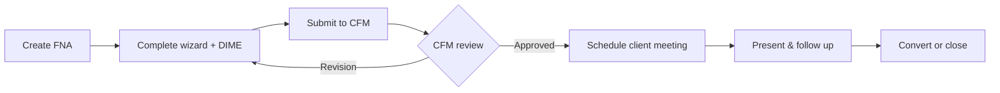
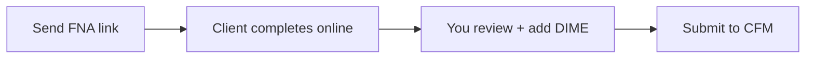
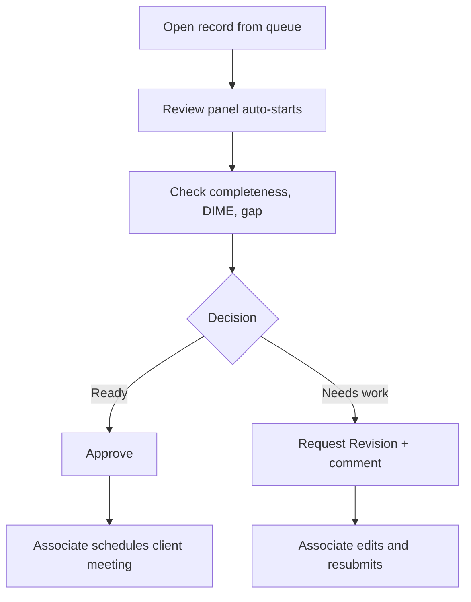

# EFGTrack — FNA Management Module
**User Guide**

**Version:** 1.1  
**Last updated:** June 2026  
**Audience:** Associates, CFMs, team leaders, and agency owners using EFGTrack  
**Hub URL:** `/team/fna` (sidebar: **FNA Management**)

---

## How to use this guide

| If you want to… | Start here |
|---|---|
| Understand what FNA Management does | [Section 1](#1-what-this-module-does) |
| Create your first FNA today | [Quick start](#quick-start) |
| See every page and URL | [Module map](#3-module-map-pages-and-urls) |
| Walk through the associate workflow | [Part 2 — For associates](#part-2-for-associates) |
| Review trainee FNAs as a CFM | [Part 3 — For CFMs](#part-3-for-cfms) |
| Send a link so a prospect fills out the FNA online | [Client portal invites](#13-client-portal-invites) |
| Fix a problem | [Troubleshooting](#23-troubleshooting) |

---

## Table of contents

**Part 1 — Overview**

1. [What this module does](#1-what-this-module-does)
2. [Who can access what](#2-who-can-access-what)
3. [Module map — pages and URLs](#3-module-map-pages-and-urls)
4. [The FNA journey (big picture)](#4-the-fna-journey-big-picture)

**Part 2 — For associates**

5. [Quick start](#quick-start)
6. [FNA dashboard](#5-fna-dashboard)
7. [My FNAs — record list](#6-my-fnas-record-list)
8. [Creating a new FNA](#7-creating-a-new-fna)
9. [FNA wizard — nine steps](#8-fna-wizard-nine-steps)
10. [DIME analysis](#9-dime-analysis)
11. [FNA record detail page](#10-fna-record-detail-page)
12. [Submitting to your CFM](#11-submitting-to-your-cfm)
13. [Client portal invites](#13-client-portal-invites)
14. [Scheduling client meetings](#15-scheduling-client-meetings)
15. [Export and PDF download](#16-export-and-pdf-download)

**Part 3 — For CFMs and leaders**

16. [CFM review queue](#12-cfm-review-queue)
17. [Agency reports](#17-agency-reports)

**Part 4 — Connections and reference**

18. [Prospect integration](#18-prospect-integration)
19. [Client portal experience](#14-client-portal-experience-prospects-members)
20. [Attachments, timeline, and meeting prep](#19-attachments-timeline-and-meeting-prep)
21. [FNA status lifecycle](#20-fna-status-lifecycle)
22. [Tasks, checklists, and notifications](#21-tasks-checklists-and-notifications)
23. [Tips and best practices](#22-tips-and-best-practices)
24. [Troubleshooting](#23-troubleshooting)
25. [Appendix](#24-appendix)

---

# Part 1 — Overview

## 1. What this module does

**FNA (Financial Needs Analysis)** helps you document a client’s or prospect’s financial picture, estimate protection needs, get CFM coaching, and prepare for client meetings — all inside EFGTrack.

### What you can do here

- **Collect facts** — nine-step wizard (client info, household, income, debt, assets, insurance, goals, risk, summary)
- **Quantify needs** — DIME analysis (Debt, Income, Mortgage, Education) with a protection gap estimate
- **Get mentor sign-off** — submit to your CFM before presenting to clients
- **Invite clients online** — secure links so prospects complete the FNA without an EFGTrack account
- **Stay organized** — link FNAs to prospects, schedule meetings, export PDFs, track status

> **Compliance reminder**  
> FNA and DIME tools are for **planning and coaching**. Results and AI suggestions are educational — not approved product recommendations. Follow your licensing, carrier, and company guidelines before advising clients.

---

## 2. Who can access what

Your role determines which menus and actions you see. If something is missing or you get **403 Forbidden**, contact your agency administrator.

### By role — what you can do

| Role | Create & edit FNAs | Submit to CFM | Review trainee FNAs | Agency reports | Send client invites |
|---|---|---|---|---|---|
| **Associate / Member / New Recruit** | Yes | Yes | — | — | Yes* |
| **Certified Field Mentor (CFM)** | Yes | — | Yes | — | Yes* |
| **Team Leader** | Yes | Yes | Yes | Yes | Yes* |
| **Agency Owner / Admin** | Yes | Yes | Yes | Yes | Yes* |

\*Requires a **license number** on your My Profile.

### Common capabilities explained

| You need to… | Who typically can |
|---|---|
| Open **FNA Management** and create records | Associates, members, CFMs, leaders |
| **Submit** an FNA for CFM review | Associates, members, new recruits, team leaders |
| Open the **CFM Review Queue** | CFMs, team leaders, agency owners |
| **Export** a PDF | Anyone with FNA access on that record |
| View **Agency Reports** | Team leaders, agency owners |
| See full **dollar amounts** on shared records | Depends on financial-details access (see appendix) |

Technical permission names (`manage fna records`, `submit fna for review`, etc.) are listed in [Appendix F](#f-permission-reference).

---

## 3. Module map — pages and URLs

### Inside EFGTrack (logged in)

| Page | URL | When to use it |
|---|---|---|
| **FNA dashboard** | `/team/fna` | Stats, trends, shortcuts |
| **My FNAs** | `/team/fna/records` | Search and filter all your records |
| **Create FNA** | `/team/fna/records/create` | Start a new draft |
| **FNA record** | `/team/fna/records/{id}` | Summary, review, attachments, scheduling |
| **FNA wizard** | `/team/fna/records/{id}/wizard` | Nine-step form + DIME tab |
| **DIME calculator** | `/team/fna/dime-calculator` | Standalone calculator |
| **Export preview** | `/team/fna/records/{id}/export` | Print or download PDF |
| **CFM review queue** | `/team/fna/cfm/review-queue` | CFMs review trainee submissions |
| **Agency reports** | `/team/fna/reports/agency` | Leader analytics |
| **Prospect FNAs** | `/team/prospects/records/{id}/fna` | FNAs linked to a prospect |

**Dashboard header shortcuts:** + New FNA · My FNAs · DIME Calculator · CFM Review Queue (CFMs) · Agency Reports (leaders)

### Client portal (public — no login)

| Page | URL | Who uses it |
|---|---|---|
| **Invite gate** | `/fna/client/invite/{token}` | Client enters security code |
| **Client wizard** | `/fna/client/invite/{token}/wizard` | Client completes the FNA |
| **Return page** | `/fna/client/return` | Client returns to a saved FNA |

---

## 4. The FNA journey (big picture)

Most FNAs follow this path. Your exact steps depend on whether you enter data yourself or send a client portal link.



**Alternate path — client portal**



### Typical timelines

| Milestone | Target |
|---|---|
| Complete draft after first meeting | 1–3 days |
| Submit to CFM | When completeness ≥ 60% |
| CFM review | Within 48 hours (agency target) |
| Client meeting | After CFM approval |
| Client portal invite validity | 30 days |

---

# Part 2 — For associates

## Quick start

**Goal:** Create an FNA, run DIME, and submit to your CFM.

1. Sidebar → **FNA Management** → **+ New FNA**
2. Enter client name → **Create** → you land in the **wizard**
3. Fill steps **1–8** (autosaves as you go)
4. Open the **DIME Analysis** tab → enter values → **Save DIME to FNA**
5. Complete step **9 (Summary)** → **Mark Ready for Review**
6. Click **Submit to CFM** (needs **60%+** completeness and an assigned CFM)
7. After approval → **Client Meeting** panel → schedule → **Export** PDF for the appointment

**Shortcut from a prospect:** Open the prospect profile → **+ Create FNA** or **Send FNA Link** for self-serve completion.

---

## 5. FNA dashboard

**URL:** `/team/fna`

Your at-a-glance command center.

### Summary cards

| Card | What it tells you |
|---|---|
| Total FNAs | All records you own or can see |
| Draft FNAs | Still in progress |
| Awaiting CFM Review | Submitted, waiting on mentor |
| Approved FNAs | Cleared for client presentation |
| Revision Requested | CFM sent back for changes |
| DIME Completed | Records with saved DIME analysis |
| Meetings This Week | FNA events on your calendar |
| Avg Protection Gap | Average gap across your records |
| Conversion After FNA | % moving toward application |
| Avg CFM Review Time | Hours from submit to approval |

### Below the cards

- **Awaiting CFM Review** and **Revision Requested** — click any row to open that record
- **Meetings This Week** — upcoming FNA calendar events
- **Status Breakdown** — how your FNAs are distributed by status
- **12-Week Trend** — activity over time (when you have records)

**Actions at the bottom:** + New FNA · View All FNAs · DIME Calculator

---

## 6. My FNAs — record list

**URL:** `/team/fna/records`

Find any record quickly.

### Filters

| Filter | Use it to find… |
|---|---|
| Search | Client name or reference code |
| Status | Draft, Submitted, Approved, etc. |
| DIME Completed | Records with or without DIME |
| Created from / to | Records in a date range |
| Gap min / max | Protection gap in dollars |

Each row shows **Reference**, **Client**, **Status**, **DIME** (✓ or —), **Gap**, **Updated**, and **View**.

Click **Clear filters** to reset.

---

## 7. Creating a new FNA

**URL:** `/team/fna/records/create`

### Standard create

1. **+ New FNA** (from dashboard or My FNAs)
2. **Client name** — use the name you will present to your CFM
3. **Title** (optional) — your own label, e.g. "Smith family — March review"
4. **Create** → opens the wizard

### From a prospect record

| Action | Result |
|---|---|
| **Send FNA Link** | Client completes FNA online (see [Section 13](#13-client-portal-invites)) |
| **Prospect FNAs** → **+ Create FNA** | New internal record linked to that prospect |

Linking to a prospect keeps your sales funnel stage, FNA status, and timeline in sync.

---

## 8. FNA wizard — nine steps

**URL:** `/team/fna/records/{id}/wizard`

The wizard **autosaves** as you type. Watch the **completeness %** at the top — you need **60%** to submit to your CFM.

### The nine steps

| # | Step | Key information |
|:---:|---|---|
| 1 | **Client Information** | Name, email, phone, DOB, occupation, location |
| 2 | **Household** | Spouse/partner, children, income & expenses |
| 3 | **Income** | Annual/monthly income, spouse & business income |
| 4 | **Debt** | Mortgage, cards, loans, other liabilities |
| 5 | **Assets** | Savings, retirement, investments, real estate |
| 6 | **Insurance** | Existing life, disability, critical illness, LTC |
| 7 | **Goals** | Income protection, retirement, education, etc. |
| 8 | **Risk Assessment** | Main concern, urgency, risk tolerance |
| 9 | **Summary** | Needs identified, next action, your recommendation |

Tap the numbered circles to jump between steps.

### Two tabs

| Tab | Purpose |
|---|---|
| **Form Steps** | The nine-step questionnaire |
| **DIME Analysis** | Protection calculator — saves to this record ([Section 9](#9-dime-analysis)) |

### Buttons (bottom of wizard)

| Button | What happens |
|---|---|
| **Previous / Next** | Move between steps |
| **Save Draft** | Manual save (autosave also runs) |
| **Mark Ready for Review** | Status → Ready for Review (needs 60%+) |
| **Submit to CFM** | Opens confirmation modal ([Section 11](#11-submitting-to-your-cfm)) |

### When can you edit?

| Status | Can edit wizard? |
|---|---|
| Draft | Yes |
| Ready for Review | Yes |
| Revision Requested | Yes |
| Submitted / Under review / Approved | No — wait for CFM or approval |

---

## 9. DIME analysis

**DIME** = **D**ebt · **I**ncome · **M**ortgage · **E**ducation

It estimates how much additional protection a household may need and calculates a **protection gap**.

### Where to run it

| Location | Best for |
|---|---|
| Wizard → **DIME Analysis** tab | Saving DIME to the current FNA |
| **DIME Calculator** (`/team/fna/dime-calculator`) | Quick estimates; add `?fna={id}` to prefill |

### What goes into the calculation

| Component | Includes |
|---|---|
| **Debt** | Cards, loans, final expenses, other debt |
| **Income** | Years to replace (default: 10), inflation adjustment |
| **Mortgage** | Balance and payoff option |
| **Education** | Per-child cost (default: $100,000), inflation |
| **Offsets** | Existing life insurance, allocated liquid assets |
| **Result** | **Protection gap** — estimated shortfall |

Click **Save DIME to FNA** when done.

> *This analysis is for educational and planning purposes only. Product suitability must follow applicable compliance, licensing, and company guidelines.*

---

## 10. FNA record detail page

**URL:** `/team/fna/records/{id}`

Open any FNA from My FNAs or the dashboard lists.

### Layout

```
┌─────────────────────────────────────────────────────────┐
│  Header: Open Wizard · Export · Back to List            │
├──────────────────┬──────────────────────────────────────┤
│  SUMMARY         │  CFM Review panel                    │
│  · Status        │  Meeting Prep (after approval)       │
│  · Completeness  │  Timeline                            │
│  · CFM           │  Attachments                         │
│  · DIME / Gap    │  Client Portal Invites (if linked)   │
│  · Status history│  Client Meeting (after approval)     │
│  · Submit button │                                      │
└──────────────────┴──────────────────────────────────────┘
```

**Revision banner:** If your CFM requested changes, their feedback appears at the top in amber.

---

## 11. Submitting to your CFM

### Before you click Submit

EFGTrack checks three things:

1. **Completeness ≥ 60%**
2. **Assigned CFM** — active mentor in EFGTrack
3. **Eligible status** — Draft, Ready for Review, or Revision Requested

### Steps

1. Click **Submit to CFM** (wizard step 9 or record sidebar)
2. Review the modal: score, missing sections, CFM name
3. Read any AI coaching hints (suggestions only — not compliance advice)
4. Confirm

**On success:** Status → **Submitted to CFM**. Your CFM is notified and may get a review task (48-hour target).

### Submission blocked?

| What you see | Fix |
|---|---|
| Below completeness threshold | Finish wizard steps + DIME |
| No CFM assignment | Check My Profile or contact upline |
| Wrong status | May already be submitted or approved |

---

## 13. Client portal invites

Send a **secure link** so a prospect or member completes the FNA online — no EFGTrack login required.

### Requirements

- License number on **My Profile**
- FNA Management access
- Valid recipient (your prospect, or eligible member)

### Where to send from

| Screen | Button / panel |
|---|---|
| Prospect profile | **Send FNA Link** |
| FNA record (linked prospect) | **Client Portal Invites** |
| Member profile | Invite for practice FNAs |

### Create an invite

1. Enter name, email, phone
2. Optional personal message
3. **Create invite link**
4. **Copy the URL and 6-digit security code immediately** — the code is shown **once**

Invites expire in **30 days**. Revoke unused invites from the invite list.

---

## 15. Scheduling client meetings

Available after **CFM approval** on the record page → **Client Meeting** panel.

1. Choose meeting type (Client FNA Meeting, Financial Review, Follow-Up, etc.)
2. Set date/time, duration (15–480 min), location or video link, notes
3. **Schedule Meeting**

Creates a calendar event and updates the prospect timeline. Status may move to **Scheduled for Client Review**. The meeting also appears on your FNA dashboard.

---

## 16. Export and PDF download

**URL:** `/team/fna/records/{id}/export`

1. Open the FNA → **Export**
2. Preview on screen
3. **Print** or **Download PDF**

If financial details are restricted on a shared record, amounts may show as masked. The PDF includes the DIME disclaimer.

---

# Part 3 — For CFMs and leaders

## 12. CFM review queue

**URL:** `/team/fna/cfm/review-queue`  
**For:** CFMs, team leaders, agency owners

### Filters

| Filter | Shows |
|---|---|
| Awaiting Review | Submitted and in progress |
| Revision Requested | Sent back to associates |
| Approved | Cleared FNAs |
| All | Everything in queue |

### Review workflow



1. Click **Review** on a row
2. Review financial summary, DIME, missing sections
3. Add **Coaching / Review Comments**
4. **Approve** — optional comment  
   **Request Revision** — comment required (min 10 characters)

Associates see **CFM Feedback** on their record when revisions are requested.

**Coaching tip:** Follow up on submissions older than **48 hours**.

---

## 17. Agency reports

**URL:** `/team/fna/reports/agency`  
**For:** Team leaders, agency owners

### By Associate

| Column | Meaning |
|---|---|
| Created | FNAs started |
| Submitted | Sent to CFM |
| Approved | Cleared by CFM |
| Avg Gap | Average protection gap |
| Avg Review (h) | Hours to CFM approval |

### By CFM

| Column | Meaning |
|---|---|
| Reviews | Total completed |
| Approval Rate | Approved vs revision |
| Avg Turnaround (h) | Hours to decision |

No data yet? Reports populate once your downline has FNA activity.

---

# Part 4 — Connections and reference

## 18. Prospect integration

FNA connects to **Prospects & Sales Funnel**. For CRM workflows from the prospect side — pipeline stages, **Send FNA Link**, and the FNA tab — see **[Section 22 of the Prospect Sales Funnel User Guide](/support/documentation/prospect-sales-funnel#22-fna-integration)**.

| In Prospects | In FNA |
|---|---|
| **Send FNA Link** | Creates client portal invite |
| **FNA tab** on prospect | Lists linked records |
| **FNA Status** field | Syncs from FNA workflow |
| **Financial Review** stage | Use while FNA is in progress |

### How prospect FNA status syncs

| Your FNA is in… | Prospect shows |
|---|---|
| Draft through Revision Requested | **Not Started** |
| Approved or Scheduled for Client Review | **Scheduled** |
| Presented, Follow-Up, Converted, or Closed | **Completed** |

---

## 14. Client portal experience (prospects & members)

**For your clients** — share this summary when sending an invite.

### First visit

1. Open the link you sent
2. Enter the **6-digit security code**
3. Set up return credentials: email, phone, last 4 of SSN

### Completing the FNA

- Same nine steps as the associate wizard
- Progress autosaves
- Session lasts **120 minutes**; return via `/fna/client/return` with credentials

### After submission

You see updated status on the FNA record and prospect timeline.

---

## 19. Attachments, timeline, and meeting prep

### Attachments

Upload statements, worksheets, or signed forms on the record page.

- Max **10 MB** per file
- Optional category
- Delete while the record is editable

### Timeline

One chronological feed of activity logs, CFM comments, and status changes. Refreshes after review actions.

### Meeting prep (AI)

After approval, the **Meeting Prep** panel may suggest talking points. **Coaching only** — review before sharing with clients.

---

## 20. FNA status lifecycle

### Phase 1 — Building the FNA (associate)

| Status | Meaning | What to do |
|---|---|---|
| **Draft** | Just created | Complete wizard + DIME |
| **Ready for Review** | You marked it complete | Submit to CFM |
| **Revision Requested** | CFM needs changes | Read feedback, edit, resubmit |

### Phase 2 — CFM review

| Status | Meaning | What happens |
|---|---|---|
| **Submitted to CFM** | In the queue | CFM opens to review |
| **Under CFM Review** | CFM is evaluating | Approve or request revision |

### Phase 3 — Client work (after approval)

| Status | Meaning | What to do |
|---|---|---|
| **Approved by CFM** | Cleared to present | Schedule meeting, export PDF |
| **Scheduled for Client Review** | Meeting on calendar | Conduct review |
| **Presented to Prospect** | Meeting done | Follow up |
| **Follow-Up Needed** | More contact required | Schedule follow-up |
| **Converted to Application** | Moving to app stage | Close out |
| **Closed** / **Archived** | Done | View only |

Every change is logged under **Status History** on the record.

---

## 21. Tasks, checklists, and notifications

### Tasks EFGTrack may create

| When… | Task example |
|---|---|
| Draft created | Complete FNA draft for {client} |
| Ready for review | Submit FNA to CFM for {client} |
| Submitted | Review FNA: {trainee} — {client} (CFM) |
| Revision requested | Revise FNA for {client} (urgent) |
| Approved | Schedule client FNA review for {client} |

Check **Tasks** in the sidebar.

### Training checklist links

| Checklist item | Opens |
|---|---|
| FAP Phase 5 — Financial Needs Analysis | FNA dashboard |
| CFM Phase 10 — FNA Assessment | CFM Review Queue |

### Notifications

- FNA **approved** or **revision requested** (associates)
- Trainee **submitted** an FNA (CFMs)
- Client **submitted** via portal (agents)

---

## 22. Tips and best practices

**Before CFM submission**
- Complete **DIME** — CFMs flag this as high priority
- Fill in **main financial concern** (step 8)
- Link the FNA to a **prospect** when applicable

**Client portal**
- Copy the **security code** immediately — it cannot be retrieved
- Send the link before your discovery call so the client arrives prepared

**Meetings**
- **Export PDF** before the appointment
- Schedule only **after CFM approval** (the system enforces this)

**Ongoing**
- Upload **attachments** to speed CFM review
- Respond quickly to **revision requests** — read the amber banner on your record
- Keep your **license number** current on My Profile

---

## 23. Troubleshooting

### FNA Management missing from sidebar

**Cause:** Your role lacks FNA access.  
**Fix:** Ask your administrator to enable FNA Management for your role.

---

### Submit to CFM disabled or fails

**Cause:** Completeness below 60%, no assigned CFM, or wrong status.  
**Fix:**

1. Finish wizard steps and save DIME
2. Confirm CFM assignment on My Profile
3. Check status — not already submitted/approved

---

### Cannot edit an FNA

**Cause:** Record is locked after submission.  
**Fix:** Editable only in Draft, Ready for Review, or Revision Requested. CFMs approve or request revision — they do not edit associate data.

---

### Send FNA Link missing

**Cause:** Missing license, permission, or linked prospect.  
**Fix:**

1. Add license number to My Profile
2. Confirm FNA Management access
3. On record page, link a prospect first for invites there

---

### Client cannot open invite

**Cause:** Expired, revoked, or wrong code.  
**Fix:**

| Issue | Action |
|---|---|
| Expired (30 days) | Create new invite |
| Revoked | Create new invite |
| Wrong / lost code | Create new invite (codes shown once) |
| Broken link | Use full URL from invite screen |

---

### DIME gap is blank

**Cause:** DIME not saved or missing income/debt inputs.  
**Fix:** Enter values → **Save DIME to FNA**.

---

### Export shows masked amounts

**Cause:** Financial-details access restricted on a shared record.  
**Fix:** You always see your own records fully. Shared views may mask dollars.

---

### CFM Review Queue empty

**Cause:** Filter too narrow, no submissions, or wrong CFM assignment.  
**Fix:** Try **All** filter; confirm trainees have submitted; verify you are their assigned CFM (or leader/owner).

---

### Agency reports empty

**Cause:** No downline FNA activity in scope.  
**Fix:** Reports populate as team members create and submit FNAs.

---

### Permission denied (403)

**Fix:** See [Section 2](#2-who-can-access-what) or [Appendix F](#f-permission-reference).

---

## 24. Appendix

### A. Wizard — required fields for completeness

Client name · client email · annual income · main financial concern

### B. Financial goal options

Income Protection · Mortgage Protection · Final Expense · Education Funding · Retirement Planning · Wealth Building · Debt Elimination · Estate Planning · Business Continuation · Tax Strategies · Legacy Planning

### C. System defaults

| Setting | Value |
|---|---|
| Income replacement years | 10 |
| Inflation rate | 3% |
| Education inflation | 5% |
| Education cost per child | $100,000 |
| CFM submit threshold | 60% completeness |
| CFM review SLA | 48 hours |
| Invite expiry | 30 days |
| Client session | 120 minutes |
| Security code | 6 digits |

### D. FNA calendar event types

FNA Review with CFM · Client FNA Meeting · Financial Review · Protection Gap Review · FNA Follow-Up · Policy Review

### E. Related guides

| Guide | Topic |
|---|---|
| [Prospects & Sales Funnel](/support/documentation/prospect-sales-funnel) | CRM, funnel stages, Send FNA Link |
| [Goals & Performance](/support/documentation/goals-and-performance) | FNA activity goals |
| [Help & Support](/support) | Tickets and all module guides |

### F. Permission reference

| Permission | What it allows |
|---|---|
| `manage fna records` | Hub, create, wizard, edit own drafts |
| `submit fna for review` | Submit to CFM |
| `review trainee fna records` | CFM Review Queue |
| `view shared fna records` | View FNAs shared with you |
| `view fna financial details` | See full dollar amounts |
| `export fna records` | PDF export |
| `view fna agency reports` | Agency Reports page |
| `manage fna settings` | Admin configuration |

---

*Questions? Go to **Help & Support** → **Browse documentation**, or open a ticket at `/support`.*
