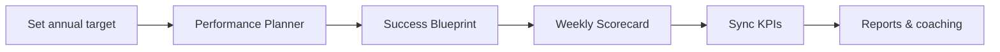
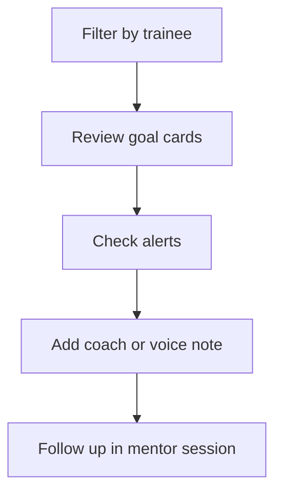

# EFGTrack — Goals & Performance Module
**User Guide**

**Version:** 1.1  
**Last updated:** June 2026  
**Audience:** Associates, CFMs, team leaders, and agency owners using EFGTrack  
**Hub URL:** `/goals` (sidebar: **Goals & Performance**)

---

## How to use this guide

| If you want to… | Start here |
|---|---|
| Understand the module | [Section 1](#1-what-this-module-does) |
| Plan your year in 10 minutes | [Quick start](#quick-start) |
| Build a full activity funnel | [Performance Planner](#6-performance-planner-goalsplan) |
| Track daily/weekly activity | [Activity Scorecard](#10-activity-scorecard-goalsscorecard) |
| Coach trainees (CFM) | [CFM Coaching](#14-cfm-coaching-goalscoaching) |
| Review downline (leader) | [Team Goals](#13-team-goals-goalsteam) |
| Fix a problem | [Troubleshooting](#21-troubleshooting) |

---

## Table of contents

**Part 1 — Overview**

1. [What this module does](#1-what-this-module-does)
2. [Who can access what](#2-who-can-access-what)
3. [Module map — pages and URLs](#3-module-map-pages-and-urls)
4. [The performance planning journey](#4-the-performance-planning-journey)

**Part 2 — Personal planning and tracking**

5. [Quick start](#quick-start)
6. [Goals hub](#5-goals-hub-goals)
7. [Performance Planner](#6-performance-planner-goalsplan)
8. [Success Blueprint](#7-success-blueprint-goalsblueprintid)
9. [Quick Goal wizard](#8-quick-goal-wizard-goalscreate)
10. [My Goals — views and filters](#9-my-goals-views-and-filters)
11. [Activity Scorecard](#10-activity-scorecard-goalsscorecard)
12. [What-If Calculator](#11-what-if-calculator-goalswhat-if)
13. [Goal Reports](#12-goal-reports-goalsreports)

**Part 3 — Leaders and CFMs**

14. [Team Goals](#13-team-goals-goalsteam)
15. [CFM Coaching](#14-cfm-coaching-goalscoaching)

**Part 4 — Reference**

16. [Key concepts](#15-key-concepts)
17. [Automated progress and KPI sync](#16-automated-progress-and-kpi-sync)
18. [Alerts, forecasts, and coaching insights](#17-alerts-forecasts-and-coaching-insights)
19. [Achievements and badges](#18-achievements-and-badges)
20. [Notifications and reminders](#19-notifications-and-reminders)
21. [Tips and best practices](#20-tips-and-best-practices)
22. [Troubleshooting](#21-troubleshooting)
23. [Appendix](#22-appendix)

---

# Part 1 — Overview

## 1. What this module does

**Goals & Performance** connects your daily activities (prospecting, FNAs, presentations, recruiting) to bigger outcomes (production, income, rank advancement).

### What you can do

| Capability | What it means for you |
|---|---|
| **Goal tracking** | Targets by category — recruiting, production, FAP, licensing, etc. |
| **Activity-based planning** | Start with income or production; work backward to daily contacts |
| **Success Blueprints** | Linked outcome + activity goals from the Performance Planner |
| **KPI automation** | Progress from Prospects, FNA, production, training, downline |
| **Scorecard** | Daily/weekly view of activity vs targets |
| **What-If** | Test targets without creating goals |
| **Team visibility** | Leaders see downline progress and off-track items |
| **CFM coaching** | Mentor notes, voice notes, deficiency alerts |
| **Reports** | PDF performance summaries |

---

## 2. Who can access what

| You need to… | Who typically can |
|---|---|
| Use the full personal hub (planner, scorecard, reports) | Anyone with **Goals & Performance** access |
| View **Team Goals** for downline | CFMs, team leaders, agency owners |
| Use **CFM Coaching** workspace | CFMs and mentors with coaching access |

If a page returns **403 Forbidden**, contact your agency administrator.

Technical permission names are in [Appendix F](#f-permission-reference).

---

## 3. Module map — pages and URLs

| Page | URL | When to use it |
|---|---|---|
| **Goals hub** | `/goals` | Dashboard, insights, all your goals |
| **Performance Planner** | `/goals/plan` | Build a Success Blueprint from a top target |
| **Quick Goal** | `/goals/create` | One goal without a full funnel |
| **Success Blueprint** | `/goals/blueprint/{id}` | Funnel progress for a created plan |
| **Activity Scorecard** | `/goals/scorecard` | Activity vs targets by period |
| **What-If Calculator** | `/goals/what-if` | Simulate without saving |
| **Goal Reports** | `/goals/reports` | PDF download or email |
| **Team Goals** | `/goals/team` | Downline visibility (leaders) |
| **CFM Coaching** | `/goals/coaching` | Trainee coaching (CFMs) |

**Hub header shortcuts:** Performance Planner · Quick Goal · Scorecard · What-If · Reports · Team Goals · CFM Coaching

---

## 4. The performance planning journey



| Tool | Creates goals? | Best for |
|---|---|---|
| **What-If** | No | Exploring targets before committing |
| **Performance Planner** | Yes — blueprint + linked goals | Official annual plan |
| **Quick Goal** | Yes — single goal | One-off or personal targets |

---

# Part 2 — Personal planning and tracking

## Quick start

**Goal:** Create your first annual plan and know what to do this week.

1. Open **Goals & Performance** → **Performance Planner**
2. Choose **Recruiting**, **Production**, or **Annual Income** based on your focus
3. Enter a realistic target → **Calculate activity funnel**
4. Review daily contacts, appointments, FNAs, applications → **Create Success Blueprint**
5. Each week: **Activity Scorecard** (weekly view) + **Sync KPIs** on the hub
6. Use **What-If** before changing targets mid-year

---

## 5. Goals hub (`/goals`)

Your home base — four sections top to bottom.

### Header and quick actions

Navy/gold header links to all sub-pages. **Performance Planner** for full funnels; **Quick Goal** for one-off targets.

### Performance insights panel

| Panel | Shows |
|---|---|
| **Active blueprint** | Link to your latest Success Blueprint |
| **Performance forecast** | Projected completion % at current pace |
| **Coaching alerts** | No prospecting, behind pace, deadline approaching |

> Forecasts need goals with deadlines and measurable progress. Create a Performance Plan if empty.

### Dashboard summary — six stat cards

| Card | Meaning |
|---|---|
| Total Goals | All goals in your account |
| Active | In progress |
| Completed | 100% or marked complete |
| Off Track | Behind expected pace |
| Completion % | Share completed |
| Current Streak | Consecutive days with goal activity |

Below: **Monthly Progress** chart · **AI Coaching** suggestions · **Progress by Category** · **Recent Achievements**

### My Goals panel

Full list with filters and six view modes — see [Section 9](#9-my-goals-views-and-filters).

---

## 6. Performance Planner (`/goals/plan`)

Reverse-engineers a top-level target into a funnel of linked goals.

### Step 1 — Choose type and target

| Planning type | Use when | Example |
|---|---|---|
| **Annual Income** | Plan from take-home income | `$100,000` |
| **Production** | Plan from premium target | `$250,000` production |
| **Recruiting** | Plan from recruit count | `12` recruits/year |
| **Rank Advancement** | Roadmap to SM, ED, SED | Select rank + date |

1. Click a planning type card
2. Enter **Target value** (and **Target rank** for rank goals)
3. Optionally edit **Plan name** and **Deadline** (defaults to year-end)
4. **Calculate activity funnel**

Uses your personal conversion rates when available; otherwise industry defaults.

### Step 2 — Review and create

Vertical funnel showing each stage with **Annual**, **Monthly**, **Weekly**, and **Daily** targets:

- **Outcome goals** (top) — income, production, recruits
- **Activity goals** (bottom) — contacts, invitations, appointments, FNAs, applications

**Create Success Blueprint** saves the plan, creates linked goals, and opens the blueprint page.

---

## 7. Success Blueprint (`/goals/blueprint/{id}`)

Living view of a Performance Plan.

### What you see

- Plan name, type, root target, **projected completion %**
- **Recommended actions** when pace is behind
- **Dependency funnel** — each stage with progress %, pace status, targets

### How to use it

1. Open from hub **Active blueprint** or after creating a plan
2. Find the **lowest stage** with red/amber pace — that's usually your bottleneck
3. Focus scorecard reviews on that activity
4. **Sync KPIs** on the hub, then return to see updates

> Only you can view your own blueprint.

---

## 8. Quick Goal wizard (`/goals/create`)

For **one goal** without a full funnel — personal development, simple monthly targets, etc.

### Nine steps

| Step | What you enter |
|---|---|
| 1. Category | 12 categories; optional quick template |
| 2. Goal name | Name, description, hierarchy level, optional parent |
| 3. Target value | Numeric target |
| 4. Measurement type | Number, currency, percentage, completion |
| 5. Deadline | Start and end dates |
| 6. Milestones | Optional sub-targets |
| 7. Accountability partner | Sponsor or mentor |
| 8. Notifications | Email, in-app, weekly reminders |
| 9. Review & create | Confirm and save |

**SMART %** badge updates as you type — aim for **80%+** before saving.

**Automated goals:** Select a **metric key** (`applications`, `fna_completed`, `recruits`, etc.) and use **Sync KPIs** for auto-updates.

---

## 9. My Goals — views and filters

### Filters

Search · Status (draft, active, completed, off track…) · Category

### View modes

| Mode | Best for |
|---|---|
| **List** | Spreadsheet with progress, deadline, SMART score |
| **Cards** | Visual cards (default) |
| **Timeline** | Goals on horizontal timeline |
| **Progress** | Emphasis on % complete |
| **Calendar** | Deadlines and milestones on month grid |
| **Kanban** | Active · Off Track · Completed |

### Sync KPIs

Pulls latest actuals from Prospects, FNA, production, training, downline into goals with a `metric_key`.

> Run **Sync KPIs** after logging prospect activity, FNAs, or production.

---

## 10. Activity Scorecard (`/goals/scorecard`)

Answers: *"Am I doing enough activity this period?"*

### Period selector

Daily · Weekly · Monthly · Quarterly · Annual

### Activity cards

Each shows **actual / target** and a progress bar:

New Prospects · Calls/Contacts · Follow-Ups · Appointments · Presentations · FNAs · Applications · Invitations · Recruits

### How targets are set

1. **Primary:** Sum from your active Performance Plan activity goals
2. **Fallback:** Generic weekly defaults (e.g. 25 contacts/week) if no plan

> Create a **Performance Plan** first for the most accurate scorecard.

---

## 11. What-If Calculator (`/goals/what-if`)

Simulate a target **without** creating goals.

1. Select goal type (income, production, recruiting, rank)
2. Enter target value
3. **Run simulation**

Results: summary cards + full funnel stage table. Saved to history only — does not create goals.

---

## 12. Goal Reports (`/goals/reports`)

PDF summaries for a reporting period.

| Period | Range |
|---|---|
| Last week | Previous calendar week |
| Last month | Previous calendar month |
| Last quarter | Previous calendar quarter |
| Last year | Previous calendar year |

**Download PDF** or **Email report** to your account email.

Includes summary stats, goals table, category scorecard, and achievements in the period.

---

# Part 3 — Leaders and CFMs

## 13. Team Goals (`/goals/team`)

**For:** CFMs, team leaders, agency owners

### Summary cards

Members with goals, total/active/completed/off track, average progress.

### Scope filter

| Scope | Shows |
|---|---|
| My goals only | Your personal goals in team view |
| Direct recruits | Direct downline goals |
| Full downline | Entire downline tree |

### View modes

**All goals** · **By member** (rollup per person) · **Needs attention** (off track or behind pace)

Filters: member · status · category · search

**Off-track banner** — yellow alert with **Review now** when goals need attention.

---

## 14. CFM Coaching (`/goals/coaching`)

**For:** CFMs and mentors with coaching access

### Workflow



- **Trainee filter** pills at top
- Each card: trainee, goal, progress %, milestones, first alert
- **Add coach note** — text or voice upload
- Sidebar: system coaching suggestions + conversion KPIs per trainee

---

# Part 4 — Reference

## 15. Key concepts

### Outcome vs activity goals

| Type | Example |
|---|---|
| **Outcome** | $100,000 income, 12 recruits |
| **Activity** | 5 daily contacts, 3 FNAs/week |

Performance Plans create both, linked in a dependency funnel.

### Goal hierarchy

`Vision` → `Annual` → `Quarterly` → `Monthly` → `Weekly` → `Daily`

### Goal statuses

| Status | Meaning |
|---|---|
| Draft | Not started |
| Active | In progress |
| Completed | Target reached |
| Off Track | Behind pace |
| Paused | Temporarily suspended |
| Cancelled | No longer pursued |

### Example activity funnel

```
Daily contacts → Conversations → Invitations → Appointments
  → Presentations → FNAs → Applications → Production → Income
```

---

## 16. Automated progress and KPI sync

| Source | Example metrics |
|---|---|
| **Prospects** | Contacts, invitations, presentations, applications |
| **Production** | Annual/monthly premium |
| **FNA** | FNAs completed, approved |
| **FAP / Licensing / Training** | Completion % |
| **Downline** | Recruits, team production |
| **Manual** | Income (until payroll integration) |

**Enable:** Choose metric key in Quick Goal, or use Performance Planner (auto-assigned). Click **Sync KPIs** on the hub.

---

## 17. Alerts, forecasts, and coaching insights

| Alert | Default trigger |
|---|---|
| No prospecting | No contacts in 7 days |
| No presentations | None in 14 days |
| No FNA activity | None in 14 days |
| Goal behind pace | Projected completion < 80% |
| Deadline approaching | Within 7 days, not complete |

Forecasts show **projected completion %** on hub, blueprint, and CFM coaching.

---

## 18. Achievements and badges

| Badge | Level | Criteria (summary) |
|---|---|---|
| First Recruit | Bronze | 1+ direct recruit |
| First Policy | Bronze | 1+ production entry |
| First Licensed Associate | Silver | Licensing 100% |
| FAP Graduate | Gold | FAP 100% |
| Top Producer | Platinum | $100,000+ annual premium |
| Leadership Builder | Diamond | 5+ team recruits |

---

## 19. Notifications and reminders

Quick Goal Step 8: email, in-app, and weekly reminders. Accountability partners may receive coach copies when configured.

---

## 20. Tips and best practices

**Planning**
- Start with one **Performance Plan** for your primary annual target
- Use **What-If** before rebuilding plans mid-year
- One primary planning type — avoid competing blueprints

**Weekly rhythm**
- **Scorecard** every week; **Sync KPIs** after field work
- Review **Success Blueprint** monthly — focus on weakest funnel stage
- **Quick Goals** for personal development outside the business funnel

**CFMs and leaders**
- Filter **Needs attention** weekly
- Download **monthly reports** for mentor meetings
- Set milestones on big goals for better visibility

---

## 21. Troubleshooting

### Buttons or dropdowns do nothing

**Cause:** Stale page or JavaScript issue.  
**Fix:** Hard-refresh (`Ctrl+F5`). Ensure JavaScript is enabled.

### PDF download does not start

**Cause:** Pop-up blocker or wrong method.  
**Fix:** Use **Download PDF** on `/goals/reports`; allow downloads from your EFGTrack domain.

### Sync KPIs shows no change

**Cause:** No metric key, or activity outside goal date range.  
**Fix:** Confirm automated metric on goal; log activity in source module first. Manual metrics (income) don't auto-sync.

### Scorecard shows 0% or low targets

**Cause:** No Performance Plan.  
**Fix:** Create a plan — otherwise generic weekly defaults apply.

### Forecasts empty

**Cause:** No goals with deadlines and measurable progress.  
**Fix:** Create active goals or a Performance Plan.

### Team Goals shows no members

**Cause:** No downline or wrong scope filter.  
**Fix:** Verify downline relationships; try Direct vs Full downline.

### CFM Coaching shows no trainees

**Cause:** No mentor assignment or trainee goals.  
**Fix:** Confirm mentor assignments; trainees need active goals.

### Permission denied (403)

**Fix:** See [Section 2](#2-who-can-access-what) or [Appendix F](#f-permission-reference).

---

## 22. Appendix

### A. Goal categories

recruiting · production · prospecting · financial_review · fap · licensing · cfm_development · leadership · training · rank_advancement · income · personal_development

### B. Measurement types

number (counts) · currency (dollars) · percentage · completion (checklist-style)

### C. Rank advancement defaults

| Rank | Production | Recruits | Licensing | FAP | Training |
|---|---|---|---|---|---|
| SM | $50,000 | 2 | 100% | 100% | 80% |
| ED | $150,000 | 5 | 100% | 100% | 100% |
| SED | $300,000 | 10 | 100% | 100% | 100% |

### D. Income planning defaults

| Constant | Default |
|---|---|
| Commission rate | 20% |
| Avg premium per application | $2,500 |
| Working days per month | 22 |
| Working weeks per year | 48 |

### E. Related guides

| Guide | Topic |
|---|---|
| [Prospects & Sales Funnel](/support/documentation/prospect-sales-funnel) | CRM activity that feeds KPI sync |
| [FNA Management](/support/documentation/fna-management) | FNA goals and metrics |
| [Training Academy](/support/documentation/training-academy) | Training completion metrics |
| [Help & Support](/support) | All module guides |

### F. Permission reference

| Permission | Allows |
|---|---|
| `manage goals` | Personal hub, planner, scorecard, what-if, reports, quick goal |
| `view team goals` | Team Goals page |
| `coach goals` | CFM Coaching workspace |

---

*Questions? **Help & Support** → **Browse documentation** or `/support`.*
