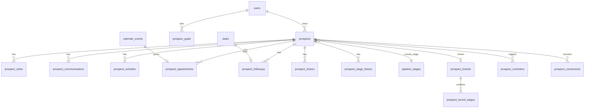

# EFGTrack — Prospect Management & Sales Funnel Module

**Version:** 2.0 Architecture  
**Stack:** Laravel 12+, Livewire 3, Alpine.js, Tailwind CSS, MySQL  
**Status:** Foundation implemented · Full funnel/CRM layer planned  

---

## 1. Executive Summary

The Prospect Management & Sales Funnel Module is EFGTrack’s primary **CRM**, **pipeline engine**, and **activity hub** for insurance associates, CFMs, Sales Managers, Executive Directors, and Agency Owners.

It must remain **privacy-first** (prospects belong to one owner by default) while supporting **controlled collaboration**, **mentorship visibility**, **team analytics**, and deep integration with Calendar, Tasks, Mentorship, Training, Notifications, Dashboard, Downline Hierarchy, Goals, and AI Recommendations.

### Current foundation (already in repo)

| Area | Status | Key paths |
|------|--------|-----------|
| Database (20+ tables) | ✅ Migrated | `database/migrations/0000_00_00_000015_create_prospect_management_tables.php` |
| Models & relationships | ✅ Scaffolded | `app/Models/Prospect*.php` |
| Policies & privacy | ✅ Scaffolded | `app/Policies/Prospect*.php`, `AuthorizesProspectAccess` |
| Dashboard (Blade) | ✅ Overview | `resources/views/team/prospects.blade.php` |
| Controller & routes | ✅ CRUD partial | `ProspectManagementController`, `routes/web.php` |
| Lookup seeders | ✅ | `ProspectLookupSeeder`, `ProspectDemoSeeder` |
| Calendar hook (stub) | 🔶 Placeholder | `app/Livewire/Calendar/ProspectAppointmentForm.php` |
| Kanban / Livewire CRM | ❌ Planned | See §8 |

---

## 2. Module Architecture

```
┌─────────────────────────────────────────────────────────────────────────┐
│                         Presentation Layer                               │
│  Livewire 3 Components · Alpine.js · Tailwind · Mobile Quick Actions    │
└─────────────────────────────────────────────────────────────────────────┘
                                    │
┌─────────────────────────────────────────────────────────────────────────┐
│                      Application / Domain Layer                          │
│  ProspectService · FunnelService · ActivityService · FollowUpEngine     │
│  ShareService · ImportService · ConversionService · AnalyticsService    │
│  ProspectAiCoachService · GoalProgressService                           │
└─────────────────────────────────────────────────────────────────────────┘
                                    │
┌─────────────────────────────────────────────────────────────────────────┐
│                    Integration Layer (Events / Jobs)                     │
│  CalendarSync · TaskBridge · NotificationDispatcher · MentorshipBridge   │
│  DashboardStatPublisher · DownlineScopeResolver · AiRecommendationFeed  │
└─────────────────────────────────────────────────────────────────────────┘
                                    │
┌─────────────────────────────────────────────────────────────────────────┐
│                         Persistence Layer                                │
│  prospects · funnel pipelines · activities · shares · goals · history   │
└─────────────────────────────────────────────────────────────────────────┘
```

### Namespace layout (target)

```
app/
├── Http/Controllers/ProspectManagementController.php   # page shells
├── Livewire/Prospects/
│   ├── Dashboard/
│   ├── Crud/
│   ├── Funnel/
│   ├── Activities/
│   ├── Calendar/
│   ├── Sharing/
│   ├── Analytics/
│   └── AiCoach/
├── Models/Prospect*.php
├── Policies/
├── Services/Prospects/
│   ├── ProspectQueryService.php
│   ├── ProspectFunnelService.php
│   ├── ProspectActivityService.php
│   ├── ProspectFollowUpEngine.php
│   ├── ProspectShareService.php
│   ├── ProspectAnalyticsService.php
│   ├── ProspectCalendarBridge.php
│   ├── ProspectTaskBridge.php
│   └── ProspectAiCoachService.php
├── Events/Prospects/
├── Jobs/Prospects/
└── DTOs/Prospects/
```

---

## 3. Permissions Model

### Spatie permissions (extend existing)

| Permission | Associate | CFM | Sales Mgr | Agency Owner | Admin |
|------------|-----------|-----|-----------|--------------|-------|
| `manage prospects` | ✅ own | ✅ shared/trainee* | ✅ team agg† | ✅ org agg† | ✅ all |
| `share prospects` | ✅ | ❌ | ❌ | ✅ policy | ✅ |
| `import prospects` | ✅ | ❌ | ❌ | ✅ | ✅ |
| `export prospects` | ✅ | ❌ | ✅ team | ✅ org | ✅ |
| `view shared prospects` | ✅ | ✅ | ✅ | ✅ | ✅ |
| `view prospect team analytics` | ❌ | 🔶 trainee | ✅ | ✅ | ✅ |
| `view prospect org analytics` | ❌ | ❌ | 🔶 | ✅ | ✅ |
| `manage prospect funnel templates` | ❌ | ❌ | ❌ | ✅ | ✅ |

\* Trainee visibility only when associate shares or CFM mentorship grant exists.  
† Aggregated/anonymized metrics unless explicit share.

### Policy rules (`ProspectPolicy`)

1. **Owner** — full CRUD on owned prospects.
2. **Shared user** — actions limited by `prospect_share_permissions` row.
3. **CFM** — view trainee prospects if `prospect_shares` OR `mentor_assignments` + `cfm_prospect_visibility` grant.
4. **Sales Manager / ED** — no row-level access unless shared; dashboard shows aggregates scoped via `DownlineHierarchyService`.
5. **Agency Owner** — org funnel reports + optional agency-wide policy flag (off by default).
6. **Admin / Super Admin** — operational override with audit log.

### Visibility presets (Access Control Panel)

| Preset | Effect |
|--------|--------|
| Private | Owner only |
| Shared with CFM | Active share to assigned CFM |
| Shared with Sponsor | Share to `users.sponsor_id` |
| Shared with Manager | Share to team leader / SM in hierarchy |
| Shared with Team | All direct downline with `view shared prospects` |
| Shared with User | Explicit user picker |

Stored in `prospect_shares` + optional `prospect_visibility_presets` on prospect row.

---

## 4. Database Design

### 4.1 Existing tables (keep)

Already migrated — see `000015_create_prospect_management_tables.php`:

- `prospects`, `prospect_sources`, `prospect_types`, `prospect_interests`, `prospect_tags`
- `pipeline_stages`, `communication_types`, `appointment_types`, `followup_statuses`
- `prospect_notes`, `prospect_communications`, `prospect_appointments`, `prospect_followups`
- `prospect_files`, `prospect_shares`, `prospect_share_permissions`, `prospect_access_logs`
- `prospect_conversions`, `prospect_imports`
- Pivots: `prospect_type_prospect`, `prospect_interest_prospect`, `prospect_tag_pivot`

### 4.2 Schema extensions (new migration)

#### `prospect_funnels`

Dual insurance + recruiting funnel templates.

```sql
id                  BIGINT PK
user_id             BIGINT NULL FK users       -- NULL = system template
key                 VARCHAR(40) UNIQUE         -- insurance | recruiting
name                VARCHAR(120)
description         TEXT NULL
is_default          BOOLEAN DEFAULT false
is_active           BOOLEAN DEFAULT true
sort_order          SMALLINT
timestamps, soft_deletes
INDEX (user_id, is_active)
```

#### `prospect_funnel_stages`

```sql
id                  BIGINT PK
prospect_funnel_id  BIGINT FK prospect_funnels
pipeline_stage_id   BIGINT NULL FK pipeline_stages  -- link to legacy stage
name                VARCHAR(120)
slug                VARCHAR(120)
sort_order          SMALLINT
conversion_weight   DECIMAL(5,2) DEFAULT 0        -- for analytics
is_terminal         BOOLEAN DEFAULT false
auto_task_template  JSON NULL                     -- task creation rules
timestamps
UNIQUE (prospect_funnel_id, slug)
INDEX (prospect_funnel_id, sort_order)
```

#### `prospect_stage_history`

Audit trail for funnel movement (Kanban drag, bulk updates).

```sql
id                  BIGINT PK
prospect_id         ULID FK prospects
from_stage_id       BIGINT NULL FK pipeline_stages
to_stage_id         BIGINT FK pipeline_stages
from_funnel_id      BIGINT NULL FK prospect_funnels
to_funnel_id        BIGINT NULL FK prospect_funnels
changed_by          BIGINT FK users
change_source       VARCHAR(40)                   -- manual | automation | import | conversion
metadata            JSON NULL
created_at          TIMESTAMP
INDEX (prospect_id, created_at)
INDEX (to_stage_id, created_at)
```

#### `prospect_activities` (unified activity log)

Superset of communications + structured activities.

```sql
id                  BIGINT PK
prospect_id         ULID FK prospects
user_id             BIGINT FK users
activity_type       VARCHAR(60)                   -- phone_call | text | email | zoom | ...
occurred_at         TIMESTAMP
duration_minutes    SMALLINT NULL
outcome             VARCHAR(80) NULL
notes               TEXT NULL
next_action         TEXT NULL
next_follow_up_at   TIMESTAMP NULL
calendar_event_id   BIGINT NULL FK calendar_events
task_id             BIGINT NULL FK tasks
metadata            JSON NULL
timestamps, soft_deletes
INDEX (prospect_id, occurred_at)
INDEX (user_id, occurred_at)
```

#### `prospect_reminders`

Smart follow-up engine output.

```sql
id                  BIGINT PK
prospect_id         ULID FK prospects
user_id             BIGINT FK users
rule_key            VARCHAR(80)                   -- hot_inactive_3d | no_contact_7d | ...
title               VARCHAR(255)
priority            ENUM low|medium|high|urgent
status              ENUM pending|snoozed|completed|dismissed
due_at              TIMESTAMP
snoozed_until       TIMESTAMP NULL
completed_at        TIMESTAMP NULL
source              VARCHAR(40)                   -- engine | manual | ai
metadata            JSON NULL
timestamps
INDEX (user_id, status, due_at)
INDEX (prospect_id, status)
```

#### `prospect_goals`

Associate activity goals.

```sql
id                  BIGINT PK
user_id             BIGINT FK users
period_type         ENUM weekly|monthly|quarterly
period_start        DATE
period_end          DATE
metric_key          VARCHAR(60)                   -- contacts | appointments | presentations | applications | recruits
target_value        INT
actual_value        INT DEFAULT 0
timestamps
UNIQUE (user_id, period_type, period_start, metric_key)
INDEX (user_id, period_start)
```

#### `prospect_goal_snapshots`

Daily rollups for charts.

```sql
id, user_id, snapshot_date, metric_key, value — indexed for dashboard queries
```

#### Alter `prospects` (additive columns)

```sql
funnel_type              ENUM insurance|recruiting|both DEFAULT insurance
prospect_funnel_id         BIGINT NULL FK prospect_funnels
interest_score             TINYINT NULL              -- 1-10
fna_status                 VARCHAR(40) NULL          -- not_started|scheduled|completed|declined
visibility_preset          VARCHAR(40) DEFAULT private
referral_source_name       VARCHAR(255) NULL
campaign_name              VARCHAR(255) NULL
event_name                 VARCHAR(255) NULL
social_source              VARCHAR(120) NULL
address_line_1             VARCHAR(255) NULL
postal_code                VARCHAR(40) NULL
home_phone                 VARCHAR(60) NULL
work_phone                 VARCHAR(60) NULL
engagement_score           DECIMAL(5,2) DEFAULT 0    -- AI / rules composite
last_activity_at           TIMESTAMP NULL INDEX
```

#### Link tables

```sql
prospect_calendar_events   prospect_id, calendar_event_id, sync_direction
prospect_tasks             prospect_id, task_id, created_reason
```

### 4.3 Dual funnel stage seed data

**Insurance funnel** (`prospect_funnels.key = insurance`)

1. New Lead  
2. Contact Attempted  
3. Contact Made  
4. Discovery Call  
5. Financial Review  
6. Solution Presented  
7. Application Submitted  
8. Underwriting  
9. Policy Issued  
10. Client  
11. Referral Partner  

**Recruiting funnel** (`prospect_funnels.key = recruiting`)

1. Prospect Added  
2. Invitation Sent  
3. Follow-Up  
4. Presentation Scheduled  
5. Presentation Attended  
6. Opportunity Review  
7. Decision Pending  
8. Registration Link Sent  
9. Registered  
10. Licensing Started  
11. Active Associate  

Map each to `pipeline_stages` slugs for backward compatibility during migration.

### 4.4 Index & performance strategy

- All list views filter `owner_id + status + deleted_at` — composite indexes exist.
- Kanban board: `owner_id + pipeline_stage_id + updated_at`.
- Follow-up engine cron: `prospect_followups(assigned_user_id, status, due_at)`.
- Analytics: pre-aggregate via `prospect_goal_snapshots` + nightly `ProspectAnalyticsRollupJob`.
- Full-text optional later: `first_name`, `last_name`, `email`, `phone` on prospects.
- ULID primary keys on prospects — stable public IDs for sharing links.

### 4.5 ERD (core relationships)



---

## 5. Workflows

### 5.1 Prospect lifecycle

```
Create → Classify (insurance/recruiting/both) → Assign funnel stage
      → Log activities → Schedule follow-ups/appointments
      → Share (optional) → Advance funnel → Convert / Archive
```

### 5.2 Funnel stage change

1. User drags card on Kanban OR edits profile stage.
2. `ProspectFunnelService::moveStage()` validates transition.
3. Insert `prospect_stage_history`.
4. Update `prospects.pipeline_stage_id`, `last_activity_at`.
5. Fire `ProspectStageChanged` event.
6. **Automation listeners:**
   - Create task from `auto_task_template`
   - Schedule reminder if stage requires follow-up
   - Sync calendar placeholder if appointment stage
   - Notify CFM if shared + hot prospect stalls
   - Update dashboard cache

### 5.3 Appointment → Calendar sync

```
ProspectAppointment created/updated
  → ProspectCalendarBridge::upsertEvent()
  → calendar_events row (type: prospect_meeting | recruiting_presentation | fna_meeting | ...)
  → Bidirectional: calendar edit updates prospect_appointments
  → Notification: owner + shared helper + CFM (if permitted)
```

### 5.4 Smart Follow-Up Engine (scheduled job)

**Rules (configurable in `config/prospects.php`):**

| Rule key | Condition | Action |
|----------|-----------|--------|
| `no_contact_7d` | `last_contacted_at` > 7 days, status active | Reminder + optional task |
| `hot_inactive_3d` | interest hot/very_hot, no activity 3 days | High priority reminder + notify CFM |
| `presentation_no_followup` | stage = Presentation Attended, no comms 2 days | Task: schedule follow-up |
| `registration_incomplete` | stage = Registration Link Sent, 5 days | Reminder + escalation |
| `application_stalled` | stage = Application Submitted, 14 days | Manager alert (aggregate) |

Job: `RunProspectFollowUpEngine` — hourly.

### 5.5 Task integration

`ProspectTaskBridge`:

- Activity logged with `next_action` → optional task creation.
- Missed appointment → task + reminder.
- Funnel stage change → template tasks.
- Tasks module stores `prospect_id` in metadata or `prospect_tasks` pivot.

### 5.6 Conversion flows

| Type | Target integration |
|------|-------------------|
| Client | `prospect_conversions`, policy refs, mark `is_client` |
| Associate | Invite link → Registration → Onboarding → CFM assignment |
| Referral partner | Tag + new lead source linkage |
| Inactive | Terminal stage + archive |

---

## 6. UI Design Specification

### Theme

- **Primary:** `#0B1F3A` navy, `#05070B` black panels  
- **Accent:** `#C8A24A` gold, `#FFF9EA` / `#FFF4CF` cream cards  
- **Style:** Executive SaaS, glassmorphism stat cards, gold borders, dark hero headers  
- **Typography:** Figtree (existing), uppercase gold eyebrow labels  

### Page map

| Route | Screen | Primary component |
|-------|--------|-------------------|
| `/team/prospects` | Command dashboard | `ProspectDashboard` |
| `/team/prospects/create` | Add prospect wizard | `ProspectCreate` |
| `/team/prospects/pipeline` | Kanban funnel board | `ProspectFunnelBoard` |
| `/team/prospects/records/{id}` | Profile hub | `ProspectProfile` |
| `/team/prospects/follow-ups` | Follow-up center | `ProspectFollowUpList` |
| `/team/prospects/appointments` | Calendar hub | `ProspectCalendar` |
| `/team/prospects/shared-with-me` | Collaborator inbox | `SharedWithMeProspects` |
| `/team/prospects/access-manager` | Sharing ACL | `ProspectPermissions` |
| `/team/prospects/analytics` | Charts & reports | `ProspectAnalytics` |
| `/team/prospects/ai-coach` | AI panel | `ProspectAiCoach` |

### Wireframe — Dashboard (`/team/prospects`)

```
┌──────────────────────────────────────────────────────────────────┐
│ [Gold eyebrow] Prospect Management          [+ Add Prospect]      │
│ Private CRM · Funnel · Activities · Coaching                      │
├──────────────────────────────────────────────────────────────────┤
│ [Stat][Stat][Stat][Stat][Stat][Stat][Stat]  ← 7 metric cards     │
├─────────────────────────────┬────────────────────────────────────┤
│ FUNNEL SNAPSHOT (tabs)      │ FOLLOW-UPS DUE TODAY               │
│ Insurance | Recruiting      │ □ Call Jane D. — Hot — Due 2pm     │
│ [===bar chart by stage===]  │ □ F/U Marcus R. — Warm             │
├─────────────────────────────┼────────────────────────────────────┤
│ HOT PROSPECTS               │ UPCOMING APPOINTMENTS              │
│ cards with quick actions    │ mini calendar + list               │
├─────────────────────────────┴────────────────────────────────────┤
│ ALL PROSPECTS TABLE [search][rank][stage][source][status][Apply] │
│ paginated · row → profile · quick log call                       │
├──────────────────────────────────────────────────────────────────┤
│ COMMUNICATION TIMELINE (recent) · GOAL PROGRESS BARS             │
└──────────────────────────────────────────────────────────────────┘
```

### Wireframe — Kanban (`/team/prospects/pipeline`)

```
┌──────────────────────────────────────────────────────────────────┐
│ Pipeline Board    [Insurance ▼] [Filter ▼] [+ Prospect]           │
├────────┬────────┬────────┬────────┬────────┬────────┬─────────────┤
│ New    │Contact │Discov. │ FNA    │ App    │Under-  │ Client      │
│ Lead   │ Made   │ Call   │ Review │ Submit │ writing│             │
│ (12)   │ (8)    │ (5)    │ (3)    │ (2)    │ (1)    │ (4)         │
│ ┌────┐ │ ┌────┐ │        │        │        │        │             │
│ │card│ │ │card│ │  ...drag & drop between columns...             │
│ └────┘ │ └────┘ │        │        │        │        │             │
│ conv 8%│ conv 42│        │        │        │        │             │
└────────┴────────┴────────┴────────┴────────┴────────┴─────────────┘
```

### Wireframe — Prospect Profile

```
┌──────────────────────────────────────────────────────────────────┐
│ ← Back   Jane Doe   [Hot ●] [Insurance]   [Share] [Edit] [···]  │
├───────────────┬──────────────────────────────────────────────────┤
│ LEFT RAIL     │ TABS: Timeline | Activities | Tasks | Calendar    │
│ Photo/Avatar  │       Funnel | Files | Notes | AI Coach         │
│ Contact btns  │─────────────────────────────────────────────────│
│ Call Text Email│ TIMELINE (chronological unified feed)           │
│ Stats mini    │ • Phone call — outcome — user — date              │
│ Funnel stage  │ • Stage moved: New Lead → Contact Made            │
│ CFM notes     │ • Appointment scheduled                             │
│ Goals widget  │ [Log Activity] [Schedule] [Add Note]            │
└───────────────┴──────────────────────────────────────────────────┘
```

### Mobile quick actions (sticky bottom bar)

`Add Prospect` · `Log Call` · `Log Text` · `Schedule` · `Note`

Prospect card: tap-to-call (`tel:`), SMS (`sms:`), mailto, timeline.

---

## 7. Livewire Component Architecture

```
App\Livewire\Prospects\
├── Dashboard/
│   ├── ProspectDashboard.php          # orchestrates dashboard sections
│   ├── ProspectStatsCards.php
│   ├── PipelineSummaryWidget.php
│   ├── HotProspectsWidget.php
│   ├── FollowUpsDueWidget.php
│   └── UpcomingAppointmentsWidget.php
├── Crud/
│   ├── ProspectIndex.php              # searchable table w/ filters
│   ├── ProspectCreate.php             # multi-step wizard
│   ├── ProspectEdit.php
│   ├── ProspectProfile.php            # tabbed hub
│   └── ProspectDeleteArchiveModals.php
├── Funnel/
│   ├── ProspectFunnelBoard.php        # Kanban + SortableJS/Alpine DnD
│   ├── ProspectKanbanColumn.php
│   ├── ProspectKanbanCard.php
│   └── ProspectStageHistoryPanel.php
├── Activities/
│   ├── ProspectTimeline.php           # unified activity feed
│   ├── ProspectActivities.php         # CRUD list
│   ├── LogActivityModal.php
│   ├── ProspectNotesPanel.php
│   └── CommunicationCenter.php
├── Calendar/
│   ├── ProspectCalendar.php           # day/week/month/agenda views
│   └── ProspectAppointmentForm.php    # extend existing stub
├── Tasks/
│   └── ProspectTasks.php              # links to Task module
├── Sharing/
│   ├── ProspectPermissions.php        # ACL panel
│   ├── ProspectShareModal.php
│   └── SharedWithMeTable.php
├── Analytics/
│   ├── ProspectAnalytics.php
│   ├── FunnelConversionChart.php
│   ├── LeadSourceChart.php
│   └── GoalProgressPanel.php
└── AiCoach/
    └── ProspectAiCoach.php            # recommendations panel
```

**Livewire patterns:**

- `wire:model.live.debounce` on search/filter.
- `#[Url]` query params for table state.
- Authorization in `mount()` via policies.
- Domain logic in services — components stay thin.
- `wire:poll.60s` on follow-up widgets (optional).

---

## 8. Dashboard Analytics

### Associate metrics (own data)

- Total / New (30d) / Hot / Follow-ups due / Appointments / Presentations / Applications / Policies / Recruits / Conversion %

### Manager metrics (downline aggregate)

Scoped via `DownlineHierarchyService::visibleMembersQuery()` — **counts only**, no PII unless shared.

### Charts (Chart.js or Apex via Livewire)

1. **Funnel conversion** — stage-to-stage drop-off  
2. **Lead source** — pie/bar from `prospect_sources`  
3. **Monthly activity trend** — communications + appointments  
4. **Prospect growth** — cumulative line  
5. **Dual pipeline** — insurance vs recruiting side-by-side  
6. **Goal achievement** — bullet charts vs `prospect_goals`  

### Dashboard integration

Publish stat cards to main EFGTrack dashboard via `DashboardStatsService` extension:

- `prospects_total`, `prospects_hot`, `followups_due`, `prospect_conversion_rate`

Detail modals link to `/team/prospects?filter=...`.

---

## 9. Calendar Integration Requirements

| Event | Calendar module action |
|-------|------------------------|
| Appointment scheduled | Create `calendar_events` with `source = prospect_appointment` |
| Follow-up due | Optional all-day or timed block |
| Presentation | Type `recruiting_presentation` |
| FNA meeting | Type `fna_meeting` |
| Team meeting | Existing calendar types |

**Sync contract (`ProspectCalendarBridge`):**

```php
interface ProspectCalendarBridge {
    public function pushAppointment(ProspectAppointment $appt): CalendarEvent;
    public function pullChanges(CalendarEvent $event): void;
    public function cancelAppointment(ProspectAppointment $appt): void;
}
```

**Views:** embed existing Calendar Livewire views with `context=prospect&prospect_id=`.

---

## 10. AI Assistant Panel

### `ProspectAiCoachService`

Inputs:

- Stage history velocity  
- Communication frequency  
- Interest score / hot rating  
- Days since last contact  
- Presentation attendance flags  
- Similar converted prospect patterns (future ML)  

Outputs (rule-based v1 → LLM v2):

```json
{
  "recommendations": [
    {
      "prospect_id": "…",
      "priority": "high",
      "message": "This prospect attended a presentation 5 days ago and has not been contacted.",
      "suggested_action": "schedule_follow_up_call",
      "suggested_due": "2026-06-05T10:00:00"
    }
  ],
  "stalled_prospects": [],
  "high_value_opportunities": []
}
```

**v1:** deterministic rules mirroring Follow-Up Engine.  
**v2:** integrate AI Recommendations Module with prompt context from anonymized funnel stats.

UI: sidebar on profile + dedicated `/team/prospects/ai-coach` with batch suggestions.

---

## 11. Automation Plan

| Trigger | Automation |
|---------|------------|
| Stage → Application Submitted | Task: confirm underwriting docs |
| Stage → Invitation Sent | Email template + 48h reminder |
| No contact 7 days | Notification + reminder row |
| Appointment completed | Log activity + suggest next stage |
| Prospect converted to associate | Fire registration workflow |
| CSV import completed | Duplicate report notification |
| Share granted | Email collaborator + access log |
| Share revoked | Immediate cache bust + notification |

**Queue jobs:** `ProcessProspectImport`, `RollupProspectAnalytics`, `RunProspectFollowUpEngine`, `SyncProspectCalendarEvents`.

---

## 12. Integration Matrix

| Module | Integration |
|--------|-------------|
| **Calendar** | Bidirectional appointment sync, agenda embed |
| **Tasks** | Auto-tasks from stages, activities, missed appts |
| **Mentorship** | CFM visibility via share + trainee grant |
| **Training** | Recruit stage → onboarding progress link |
| **Notifications** | In-app + email for reminders, shares, escalations |
| **Dashboard** | Stat cards + journey hub links |
| **Downline** | Manager analytics scope, sponsor share preset |
| **Goals** | `prospect_goals` + weekly/monthly targets |
| **AI Recommendations** | Coach panel + stalled prospect scoring |
| **Registration** | Conversion → invite token |
| **Licensing / FAP** | Recruit funnel terminal stages |

---

## 13. Implementation Roadmap

### Phase 1 — Foundation hardening (2 weeks)

- [ ] Extend migration for funnel tables + prospect columns  
- [ ] Seed insurance + recruiting funnel stages  
- [ ] `ProspectFunnelService`, `ProspectStageHistory`  
- [ ] Complete `ProspectCreate` / `ProspectEdit` Livewire forms  
- [ ] Prospect profile tabs (timeline, notes, activities)  

### Phase 2 — Funnel & activities (2–3 weeks)

- [ ] `ProspectFunnelBoard` Kanban with drag-and-drop  
- [ ] Unified `prospect_activities` + timeline component  
- [ ] Log activity / communication modals  
- [ ] Stage change automations (events/listeners)  

### Phase 3 — Calendar & tasks (2 weeks)

- [ ] `ProspectCalendarBridge` full implementation  
- [ ] `ProspectTaskBridge`  
- [ ] Follow-up center Livewire refactor  
- [ ] Smart Follow-Up Engine job  

### Phase 4 — Sharing & permissions UI (1 week)

- [ ] Access Control Panel Livewire  
- [ ] Visibility presets (CFM, sponsor, manager, team)  
- [ ] Access log viewer  

### Phase 5 — Analytics & goals (2 weeks)

- [ ] `ProspectAnalyticsService` + rollup job  
- [ ] Charts on analytics page  
- [ ] `prospect_goals` CRUD + progress bars  
- [ ] Manager/org aggregate dashboards  

### Phase 6 — AI & mobile polish (2 weeks)

- [ ] `ProspectAiCoachService` v1 rules  
- [ ] Mobile quick actions + click-to-call cards  
- [ ] Import wizard Livewire  
- [ ] Export CSV  

### Phase 7 — Conversion bridges (ongoing)

- [ ] Associate conversion → registration pipeline  
- [ ] Client conversion → policy tracking  
- [ ] Dashboard + notification deep links  

---

## 14. Testing Strategy

```
tests/Feature/Prospects/
├── ProspectPrivacyTest.php
├── ProspectFunnelBoardTest.php
├── ProspectSharePermissionsTest.php
├── ProspectFollowUpEngineTest.php
├── ProspectCalendarSyncTest.php
├── ProspectAnalyticsScopeTest.php
└── ProspectConversionTest.php

tests/Unit/Prospects/
├── ProspectFunnelServiceTest.php
├── ProspectFollowUpRulesTest.php
└── ProspectAiCoachServiceTest.php
```

Existing: `ProspectManagementModuleTest.php` — extend for Livewire flows.

---

## 15. Security & Compliance

- All prospect queries scoped through `ProspectQueryService::forUser($user)`.
- Shared access checks: active, not revoked, not expired.
- Every share grant/revoke → `prospect_access_logs`.
- Export requires permission; CSV excludes other users’ private data.
- GDPR-style delete: soft delete prospect + anonymize communications option (future).
- Rate limit import endpoints.

---

## 16. File Reference (current codebase)

| Asset | Path |
|-------|------|
| Architecture v1 | `PROSPECT_MANAGEMENT_MODULE.md` |
| Migration | `database/migrations/0000_00_00_000015_create_prospect_management_tables.php` |
| Controller | `app/Http/Controllers/ProspectManagementController.php` |
| Dashboard view | `resources/views/team/prospects.blade.php` |
| Record view | `resources/views/team/prospect-record.blade.php` |
| Policies | `app/Policies/Prospect*.php` |
| Demo data | `database/seeders/ProspectDemoSeeder.php` |

---

*This document is the canonical blueprint for the EFGTrack Prospect Management & Sales Funnel Module. Implement phase-by-phase; extend `PROSPECT_MANAGEMENT_MODULE.md` checklists as phases complete.*
