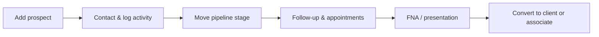

# EFGTrack — Prospect Sales Funnel
**User Guide**

**Version:** 1.1  
**Last updated:** June 2026  
**Audience:** Associates, team leaders, CFMs, and agency owners managing personal prospects in EFGTrack  
**Hub URL:** `/team/prospects` (sidebar: **Prospect Management**)

---

## How to use this guide

| If you want to… | Start here |
|---|---|
| Understand your private CRM | [Section 1](#1-what-this-module-does) |
| Learn who can see your prospects | [Privacy rules](#2-privacy-and-data-ownership) |
| Start prospecting today | [Quick start](#quick-start) |
| Move prospects on the board | [Pipeline Board](#9-pipeline-board-kanban) |
| Log calls and follow-ups | [Activities](#13-logging-activities-and-communications) |
| Connect to FNA | [FNA integration](#22-fna-integration) |
| Fix a problem | [Troubleshooting](#26-troubleshooting) |

---

## Table of contents

**Part 1 — Overview**

1. [What this module does](#1-what-this-module-does)
2. [Privacy and data ownership](#2-privacy-and-data-ownership)
3. [Who can access what](#3-who-can-access-what)
4. [Module map — pages and URLs](#4-module-map-pages-and-urls)
5. [The prospecting journey](#the-prospecting-journey)
6. [Recommended workflows](#5-recommended-workflows)

**Part 2 — Daily prospecting**

7. [Quick start](#quick-start)
8. [Prospect Management dashboard](#6-prospect-management-dashboard)
9. [Adding and editing prospects](#7-adding-and-editing-prospects)
10. [The sales funnel explained](#8-the-sales-funnel-explained)
11. [Pipeline Board (Kanban)](#9-pipeline-board-kanban)
12. [Insurance funnel stages](#10-insurance-funnel-stages)
13. [Recruiting funnel stages](#11-recruiting-funnel-stages)
14. [Prospect profile](#12-prospect-profile)
15. [Logging activities and communications](#13-logging-activities-and-communications)
16. [Follow-Up Center](#14-follow-up-center)
17. [Stage automations](#15-stage-automations)
18. [Appointment Calendar](#16-appointment-calendar)

**Part 3 — Conversion and collaboration**

19. [Converting prospects](#17-converting-prospects)
20. [Sharing with mentors and leaders](#18-sharing-prospects-with-mentors-and-leaders)
21. [Import and export](#19-import-and-export)

**Part 4 — Insights and connections**

22. [Analytics, goals, and team aggregates](#20-analytics-goals-and-team-aggregates)
23. [AI Coach](#21-ai-coach)
24. [FNA integration](#22-fna-integration)
25. [Connections to Goals & Performance](#23-connections-to-goals-performance)

**Part 5 — Reference**

26. [Key concepts](#24-key-concepts)
27. [Tips and best practices](#25-tips-and-best-practices)
28. [Troubleshooting](#26-troubleshooting)
29. [Appendix](#27-appendix)

---

# Part 1 — Overview

## 1. What this module does

The **Prospect Sales Funnel** (Prospect Management module) is your private CRM inside EFGTrack. It helps you track people you are prospecting for **insurance sales** and **associate recruiting** — from first contact through presentation, application, and conversion.

At a high level, the module provides:

| Capability | What it means for you |
|---|---|
| **Private prospect records** | Your leads belong to you unless you explicitly share them |
| **Dual sales funnels** | Separate pipelines for insurance prospects and recruiting prospects |
| **Pipeline Board** | Drag-and-drop Kanban view of where each prospect stands |
| **Activity tracking** | Log calls, meetings, presentations, and communications |
| **Follow-Up Center** | Never miss a scheduled follow-up or overdue task |
| **Appointments** | Schedule prospect meetings synced to your EFGTrack calendar |
| **Conversions** | Turn prospects into clients, associate recruits, or inactive records |
| **Controlled sharing** | Let your CFM or sponsor collaborate without giving up ownership |
| **Analytics & period goals** | Measure funnel conversion, sources, and activity trends |
| **AI Coach** | Rule-based suggestions for stalled leads and hot opportunities |
| **CSV import/export** | Bulk load prospects and export your pipeline |

This module is designed for **daily prospecting discipline** — not just storing names. Every stage move, call, and follow-up builds a complete history you can review with your mentor.

---

## 2. Privacy and data ownership

**Prospects are private by default.**

| Rule | What it means |
|---|---|
| **Owner-only** | You see prospects you created or imported. They are assigned to your user account. |
| **Explicit sharing** | Other users see your prospects only if you share them with a defined permission level. |
| **Active access** | Shared access must be active, not revoked, and not past its expiration date. |
| **Immediate revocation** | When you revoke a share, the other person loses access right away. |
| **No automatic leader access** | Team leaders, CFMs, and agency owners do **not** automatically see your prospect details. |
| **Platform admins** | Super Admin and Admin roles may access records for platform support (agency policy may vary). |

When collaborating, use **Share** on the prospect profile with the minimum permission level needed — for example, *View Only* for a quick review, or *Add Communication Logs* when your CFM is helping you follow up.

---

## 3. Who can access what

| You need to… | Who typically can |
|---|---|
| Full CRM (dashboard, pipeline, profile, follow-ups) | Associates, members, CFMs, leaders |
| View prospects **shared with you** | Anyone with shared-prospect access |
| **Share** your prospects with a CFM or sponsor | Prospect owners with share permission |
| **Import** CSV leads | Members with import enabled |
| **Export** your list as CSV | Members with export enabled |
| **Schedule** prospect appointments | Members with appointment permission |

If a menu item is missing or you get **403 Forbidden**, contact your agency administrator.

Technical permission names: [Appendix O](#o-permission-reference).

---

## 4. Module map — pages and URLs

| Page | URL | Purpose |
|---|---|---|
| **Prospect dashboard** | `/team/prospects` | Stats, pipeline summary, prospect list, shortcuts |
| **Add prospect** | `/team/prospects/create` | Create a new prospect in your funnel |
| **Prospect profile** | `/team/prospects/records/{id}` | Full record: contact info, timeline, FNA |
| **Edit prospect** | `/team/prospects/records/{id}/edit` | Update fields and pipeline stage |
| **Activity page** | `/team/prospects/records/{id}/activity` | Focused activity/timeline view |
| **Pipeline Board** | `/team/prospects/pipeline` | Kanban funnel board |
| **Follow-Up Center** | `/team/prospects/follow-ups` | All follow-up tasks |
| **Appointment Calendar** | `/team/prospects/appointments` | Schedule prospect appointments |
| **Analytics & Goals** | `/team/prospects/analytics` | Funnel charts, sources, period goals |
| **Access Manager** | `/team/prospects/access-manager` | Audit and manage sharing |
| **Shared With Me** | `/team/prospects/shared-with-me` | Prospects others shared with you |
| **Shared By Me** | `/team/prospects/shared-by-me` | Prospects you have shared |
| **AI Coach** | `/team/prospects/ai-coach` | Pipeline coaching suggestions |
| **Import** | `/team/prospects/import` | CSV import wizard |
| **Export** | `/team/prospects/export` | Download CSV export |
| **Prospect FNA** | `/team/prospects/records/{id}/fna` | FNA records linked to prospect |

---

## The prospecting journey

**Insurance path:** New Lead → Contact → Discovery → Financial Review → Solution → Application → Client

**Recruiting path:** Prospect Added → Presentation → Registration Link → Active Associate

---

## 5. Recommended workflows

### Daily prospecting routine (insurance)

1. Open **Follow-Up Center** — work overdue and due-today items first.
2. Check **AI Coach** for hot prospects or stalled applications.
3. Open **Pipeline Board** — move prospects forward after each meaningful contact.
4. **Log every call and meeting** the same day (from the board, profile, or quick-log).
5. Schedule **next follow-up** when logging activity.
6. Review **Period Goals** on Analytics to stay on weekly/monthly contact targets.

### Weekly pipeline review (with CFM)

1. Share selected prospects with your CFM (*Add Notes* or *Full Collaboration* permission).
2. Walk through **Pipeline Board** insurance funnel — identify stuck stages.
3. Review **Funnel Conversion** chart on Analytics for drop-off points.
4. Convert ready prospects to **Client** or send **FNA links** where appropriate.
5. Revoke or update shares when the review is complete.

### Recruiting a new associate

1. Create prospect with funnel type **Recruiting Prospect**.
2. Move through recruiting stages: invitation → presentation → registration link.
3. Use **Convert → Associate** to generate an invitation registration link.
4. Track **Registration Link Sent** and follow up until **Registered**.
5. After they join EFGTrack, their progress continues in onboarding and licensing trackers.

### Bulk lead intake (event or spreadsheet)

1. Go to **Import Prospects**.
2. Upload CSV, map columns, review duplicates.
3. Confirm import — all records are assigned to **you** only.
4. Open **Pipeline Board** and assign appropriate stages.
5. Set interest level and priority on hot leads.

---

# Part 2 — Daily prospecting

## Quick start

**Goal:** Log your first prospect and schedule a follow-up.

1. **Prospect Management** → **Add Prospect**
2. Enter name, funnel type (Insurance or Recruiting), source, interest level
3. Open **Pipeline Board** — drag the card to the correct stage after first contact
4. **Log Call** from the card or profile — set **next follow-up** date
5. Tomorrow: open **Follow-Up Center** and work due items first

---

## 6. Prospect Management dashboard

The dashboard (`/team/prospects`) is your command center.

### Summary cards

| Card | Meaning |
|---|---|
| **My Prospects** | Total active prospects you own |
| **Hot Prospects** | Prospects marked with hot interest level |
| **Follow-Ups Due** | Pending or overdue follow-up tasks |
| **Appointments** | Upcoming scheduled appointments |
| **Shared With Me** | Prospects others have shared with you |
| **Shared By Me** | Prospects you have shared with others |
| **Conversion Rate** | Your historical conversion percentage |

### Dashboard panels

- **Pipeline Summary** — stage counts; click **Open Board** for Kanban view.
- **Follow-Up Center** — preview of due follow-ups; click **View All**.
- **All Prospects** — searchable, filterable table (status, funnel type, stage, interest).
- **Hot Prospects** — priority leads needing attention.
- **Recently Contacted** — who you touched recently.
- **Communication Timeline** — recent activity across your pipeline.
- **Shared With Me / Shared By Me** — collaboration overview.
- **Import summary** — recent CSV import results.
- **Module Shortcuts** — quick links to every sub-module.
- **Period Goals** (compact) — weekly/monthly prospecting metrics.
- **Privacy Rules** — reminder of ownership defaults.

Use the **Add Prospect** button (top right) from any major screen to create records quickly.

---

## 7. Adding and editing prospects

### Add Prospect (`/team/prospects/create`)

Fill in the form to place someone in your funnel:

| Field group | Guidance |
|---|---|
| **Funnel Type** | Insurance Prospect, Recruiting Prospect, or Insurance & Recruiting |
| **Name & contact** | First/last name, preferred name, email, mobile, home/work phone |
| **Address** | Street, city, state/province, country, postal code |
| **Pipeline Stage** | Starting stage (defaults to first stage of the funnel if left blank) |
| **Lead Source** | How you met them (Warm Market, Referral, Social Media, etc.) |
| **Interest Level** | Cold, Warm, or Hot |
| **Interest Score** | Optional 1–10 rating |
| **Priority** | Low, Medium, High, or Urgent |
| **FNA Status** | Not Started, Scheduled, Completed, or Declined |
| **Referral / Campaign** | Optional tracking fields |
| **Notes Summary** | Free-text overview |

Click **Create Prospect**. The record is private to you and appears on your Pipeline Board at the selected stage.

### Edit Prospect

From the prospect profile, click **Edit** to update any field, change stage, adjust interest/priority, or set **Next Follow-Up** datetime.

---

## 8. The sales funnel explained

A **funnel** is the structured path a prospect follows from first contact to conversion. EFGTrack provides two default funnels:

| Funnel | Key | Used for |
|---|---|---|
| **Insurance Funnel** | `insurance` | Life insurance and financial solutions sales |
| **Recruiting Funnel** | `recruiting` | Building your team with new associates |

### Funnel type on each prospect

When creating a prospect, choose a **Funnel Type**:

| Type | Pipeline Board view | Description |
|---|---|---|
| **Insurance Prospect** | Insurance funnel | Sales-focused pipeline |
| **Recruiting Prospect** | Recruiting funnel | Team-building pipeline |
| **Insurance & Recruiting** | Insurance funnel | Dual-interest contact; appears on insurance board |

### Stage

Each prospect sits in exactly one **pipeline stage** at a time. Moving stages records history and may trigger **automated follow-ups** (see [Stage automations](#15-stage-automations)).

### Terminal stages

Some stages mark the end of active prospecting (e.g., **Client**, **Active Associate**, **Referral Partner**). After conversion, prospects may be archived or marked inactive.

---

## 9. Pipeline Board (Kanban)

**Pipeline Board** (`/team/prospects/pipeline`) is the visual heart of the sales funnel.

### Using the board

1. Select **Funnel** — Insurance Prospect or Recruiting Prospect.
2. Each column is a **pipeline stage** with a count badge.
3. **Drag a prospect card** from one column to another to advance (or regress) their stage.
4. Click a prospect **name** to open their full profile.
5. Use **Log Call** or **Log Activity** buttons on cards without leaving the board.
6. Click **+ Add Prospect** to create a new lead.

### What each card shows

- Prospect display name
- Phone icon (tap to call on mobile)
- Interest level badge (Cold / Warm / Hot)
- Priority badge (if High or Urgent)
- Follow-up due/overdue indicator

### Who appears on the board

Only **your** active, non-archived prospects in the selected funnel type. Shared prospects you collaborate on appear on the owner's board, not yours (unless you own them).

### Stage changes are tracked

Every drag-and-drop move records **stage history** (who changed it, when, and source = Kanban). This appears on the prospect **Timeline** tab.

---

## 10. Insurance funnel stages

Default insurance pipeline (left to right on the Pipeline Board):

| # | Stage | Typical meaning |
|---|---|---|
| 1 | **New Lead** | Name captured; no contact yet |
| 2 | **Contact Attempted** | You tried to reach them |
| 3 | **Contact Made** | Two-way conversation established |
| 4 | **Discovery Call** | Initial needs conversation |
| 5 | **Financial Review** | FNA / fact-finding in progress |
| 6 | **Solution Presented** | Product or plan presented |
| 7 | **Application Submitted** | Application sent to carrier |
| 8 | **Underwriting** | Carrier reviewing application |
| 9 | **Policy Issued** | Policy approved and issued |
| 10 | **Client** | Terminal — became a client |
| 11 | **Referral Partner** | Terminal — ongoing referral relationship |

### Suggested actions by stage

| Stage | Your next step |
|---|---|
| New Lead → Contact Attempted | Make first contact (call, text, DM) |
| Contact Made → Discovery Call | Schedule FNA or discovery meeting |
| Financial Review | Complete FNA; send FNA client link if self-serve |
| Solution Presented | Log presentation; schedule post-presentation follow-up |
| Application Submitted | Confirm underwriting documents (auto follow-up may be created) |
| Policy Issued → Client | **Convert to Client** with policy reference |

---

## 11. Recruiting funnel stages

Default recruiting pipeline:

| # | Stage | Typical meaning |
|---|---|---|
| 1 | **Prospect Added** | Recruit name in system |
| 2 | **Invitation Sent** | Initial invite to learn about the opportunity |
| 3 | **Follow-Up** | Awaiting response; nurture contact |
| 4 | **Presentation Scheduled** | BOP or opportunity meeting booked |
| 5 | **Presentation Attended** | They attended the presentation |
| 6 | **Opportunity Review** | Discussing fit and next steps |
| 7 | **Decision Pending** | They are deciding whether to join |
| 8 | **Registration Link Sent** | EFGTrack invitation link sent |
| 9 | **Registered** | They completed registration |
| 10 | **Licensing Started** | Working on licensing requirements |
| 11 | **Active Associate** | Terminal — fully onboarded associate |

### Suggested actions by stage

| Stage | Your next step |
|---|---|
| Presentation Attended | Log meeting; schedule follow-up within 48 hours (automation may apply) |
| Registration Link Sent | **Convert → Associate** to generate link; follow up in 5 days if not registered |
| Registered | Support onboarding, licensing tracker, FAP assignment |
| Active Associate | Celebrate conversion; transition from prospect to team member record |

---

## 12. Prospect profile

Open any prospect from the dashboard, pipeline board, or follow-up list.

### Header actions

| Button | When available | Purpose |
|---|---|---|
| **Convert** | Owner | Client, associate, or inactive conversion |
| **Share** | Owner | Grant collaboration access |
| **Send FNA Link** | FNA permission + license on profile | Invite prospect to complete FNA online — see [FNA integration](#22-fna-integration) |
| **Edit** | Owner or edit permission | Update record |
| **Activity** | View access | Dedicated activity page |
| **Back** | Always | Return to dashboard |

### Summary cards

- **Funnel** — Insurance or Recruiting funnel name
- **Stage** — current pipeline stage
- **Interest** — level and optional score
- **Source** — lead source

### Contact panel

Shows phone numbers, email, address, appointment date, follow-up date, tags, and quick actions (call, text, email).

### Profile tabs

| Tab | Contents |
|---|---|
| **Timeline** | Unified history: stage changes, activities, notes, communications |
| **Activities** | Structured activity log (calls, meetings, presentations) |
| **Calls & Comms** | Communication log with type and direction |
| **Notes** | Free-form notes (private notes visible only to you) |
| **FNA** | Linked FNA records and client invite status — see [FNA integration](#22-fna-integration) and the [FNA Management User Guide](/support/documentation/fna-management) |

### Quick action buttons (on tabs)

- **Log Call** — opens activity modal preset to phone call
- **Log Activity** — any activity type
- **Log Communication** — call, text, email, etc.

### AI Coach panel

If rules match this prospect, inline suggestions appear at the bottom of the profile with quick actions.

### Conversion history

After conversions, a table shows type, date, who converted, policy/application references, and linked member accounts.

---

## 13. Logging activities and communications

Consistent logging keeps your funnel accurate and powers analytics, AI Coach, and goal tracking.

### Log Activity (modal)

Available from profile, pipeline board, and AI Coach.

| Field | Purpose |
|---|---|
| **Activity Type** | Phone Call, Text, Email, Zoom Meeting, In-Person Meeting, Presentation, Follow-Up, Policy Review, Recruitment Meeting, Financial Review, Referral Request |
| **Date & Time** | When it happened |
| **Outcome** | Short result (e.g., "Left voicemail", "Booked FNA") |
| **Notes** | Details |
| **Next Action** | What you will do next |
| **Next Follow-Up** | Schedules your next touchpoint |

Saving updates **last contacted** on the prospect and may create a follow-up entry.

### Log Communication (modal)

Similar to activity logging but tied to **communication types** (Call, Text, Email, Zoom Meeting, Presentation, No Answer, Voicemail Left, etc.) with **direction** (inbound/outbound).

### Best practice

Log **every meaningful touch** the same day. If you move a stage on the Pipeline Board after a presentation, also log the presentation activity with outcome and next follow-up date.

---

## 14. Follow-Up Center

**Follow-Up Center** (`/team/prospects/follow-ups`) lists all follow-up tasks across your prospects.

### Filters

| Filter | Options |
|---|---|
| **Status** | Pending & Overdue (default), Pending, Overdue, Completed, Cancelled |
| **Priority** | Urgent, High, Medium, Low |
| **Due from / Due to** | Date range |

### Table columns

Prospect name, follow-up type, priority, due date/time, status, notes, and actions.

### Actions on open follow-ups

| Action | Effect |
|---|---|
| **Complete** | Marks follow-up done |
| **Snooze +1d** | Pushes due date forward one day |

Click the prospect name to jump to their profile and log the contact that completes the follow-up.

### Follow-up sources

Follow-ups come from:

- Manual scheduling when logging activities
- **Stage automations** when you move to certain stages
- **Follow-up engine** rules (e.g., no contact in 7+ days)

---

## 15. Stage automations

When you move a prospect to certain stages, EFGTrack can **automatically create follow-up tasks** (and sometimes My Tasks items) so critical next steps are not forgotten.

### Examples (default configuration)

| Trigger stage | Auto follow-up |
|---|---|
| **Application Submitted** (insurance) | High-priority underwriting check in 3 days |
| **Presentation Attended** (recruiting) | Post-presentation follow-up in 2 days |
| **Registration Link Sent** | Engine may flag if not completed in 5 days |
| **Application Submitted** (stalled 14+ days) | Urgent review task |

Automations run when stage changes via Pipeline Board, profile edit, or any update path. They assign follow-ups to **you** as the prospect owner.

You still control completion — snooze or complete follow-ups in the Follow-Up Center as your situation evolves.

---

## 16. Appointment Calendar

**Appointment Calendar** (`/team/prospects/appointments`) schedules meetings with prospects.

### Schedule an appointment

1. Click **+ Schedule Appointment**.
2. Select **Prospect**.
3. Choose **Appointment type** (FNA Appointment, BOP, Follow-Up Call, etc.).
4. Set **Date & time**.
5. Optionally assign a **Helper / mentor** (e.g., your CFM joins the meeting).
6. Enter **Location or meeting link** (office address or Zoom URL).
7. Add **Purpose** and **Notes**.
8. Click **Save Appointment**.

Appointments sync to your main **EFGTrack Calendar** (`/calendar`).

### Managing appointments

- View **Upcoming** and **Past** lists.
- Mark outcomes (completed, no-show, rescheduled) from the appointment hub.
- Click prospect name to open profile.

Use appointments for discovery calls, FNA meetings, BOP presentations, and recruiting interviews.

---

# Part 3 — Conversion and collaboration

## 17. Converting prospects

When a prospect reaches a successful outcome, **Convert** records the result and updates their status.

Open **Convert** from the prospect profile header.

### Convert to Associate (recruiting)

1. Select the **Associate** tab.
2. Add optional notes.
3. Click **Create Invitation**.
4. EFGTrack generates a **registration invitation link** tied to your sponsor tree.
5. Copy and send the link to your prospect.

If the prospect has no email on file, the link is not restricted to a specific address — add email first when possible.

After registration, the new member flows into onboarding, CFM assignment, and licensing.

### Convert to Client (insurance)

1. Select the **Client** tab.
2. Enter **Policy Reference** (required).
3. Optionally enter **Application Reference** and notes.
4. Click **Convert to Client**.

The prospect is marked as a client conversion with audit history.

### Convert to Inactive

1. Select the **Inactive** tab.
2. Enter an optional reason (not interested, bad timing, do not contact).
3. Confirm.

The prospect is archived from active pipeline views but history is retained.

---

## 18. Sharing prospects with mentors and leaders

### Share from profile

1. Click **Share** on a prospect you own.
2. Choose a **Visibility Preset**:

| Preset | Shares with |
|---|---|
| Private | Removes sharing (owner only) |
| Shared with CFM | Your assigned Certified Field Mentor |
| Shared with Sponsor | Your sponsor in the hierarchy |
| Shared with Manager | Team leadership (per agency setup) |
| Shared with Team | Broader team visibility (per agency setup) |
| Shared with User | Search and pick a specific person |

3. Select **Permission Level** (see appendix).
4. Optionally set an **Expiration date**.
5. Click **Save Sharing**.

### Manage shares

- **Shared By Me** — list of active shares; **Revoke** anytime.
- **Access Manager** — audit trail of grants and revocations.
- **Shared With Me** — prospects others shared with you; open read-only or collaborative per permission.

Shared users see only what their permission level allows. They cannot convert or re-share unless explicitly permitted.

---

## 19. Import and export

### Import (`/team/prospects/import`) — requires `import prospects`

Four-step wizard:

| Step | Action |
|---|---|
| 1. Upload | Select CSV file (max 2MB) |
| 2. Map Columns | Match CSV headers to fields: first name, last name, email, phone, city, source, funnel type |
| 3. Duplicates | Review rows matching existing email or phone; duplicates are **skipped** on import |
| 4. Confirm | Run import; all new records belong to **you** |

Imported prospects start at the default first stage of their funnel type.

### Export (`/team/prospects/export`) — requires `export prospects`

Download a CSV of your prospects including ID, names, contact info, funnel type, stage, interest, source, status, and created date. Use for backup, mail merges, or external analysis.

**Export never includes other users' private prospects.**

---

# Part 4 — Insights and connections

## 20. Analytics, goals, and team aggregates

**Analytics & Goals** (`/team/prospects/analytics`) measures pipeline health.

### Summary metrics

Active prospects, new in last 30 days, hot count, follow-ups due, upcoming appointments, conversion rate, insurance vs recruiting pipeline counts.

### Funnel Conversion chart

Select **Insurance** or **Recruiting** funnel. See prospect count per stage and **drop-off percentage** between stages. Use this to find where leads stall (e.g., many at Discovery Call but few at Application Submitted).

### Lead Sources

Bar chart of prospects by acquisition source — identifies your best lead channels.

### Monthly Activity

Communications, activities, and appointments over recent months.

### Prospect Growth

Cumulative new prospects added over six months.

### Dual Pipeline

Side-by-side insurance vs recruiting stage distribution.

### Period Goals (sidebar)

Set weekly or monthly targets for prospecting metrics:

| Metric | Examples |
|---|---|
| Contacts | Calls and touches |
| Appointments | Meetings scheduled |
| Presentations | BOP/FNA presentations delivered |
| Applications | Apps submitted |
| Recruits | New associates registered |
| New Prospects | Names added to CRM |

Track progress bars; edit or delete goals on the full analytics page. Goals on the dashboard compact panel link here.

### Team Aggregates (leaders only)

If you have downline visibility, a **Team Aggregates** panel shows **non-PII** totals: team prospect counts, hot prospects, follow-ups due, and average conversion rate across your scope. Individual prospect names are not shown to protect privacy.

---

## 21. AI Coach

**AI Coach** (`/team/prospects/ai-coach`) provides **read-only, rule-based recommendations** — not generative AI chat. Suggestions appear when your pipeline matches configured patterns.

### Recommendation types (examples)

| Situation | Suggestion |
|---|---|
| Presentation with no follow-up | Schedule follow-up; log call |
| Hot prospect inactive 3+ days | Prioritize contact today |
| No contact in 7+ days | Reach out to inactive prospect |
| Registration link not completed | Escalate follow-up |
| Application stalled 14+ days | Urgent review |
| Overdue follow-up | Act today |

### Using AI Coach

1. Open **AI Coach** from dashboard shortcuts or prospect profile panel.
2. Review items grouped by **High / Medium / Low** priority.
3. Click **Log Call**, **Schedule**, or **View Profile** to act.
4. Acting on a suggestion does not auto-dismiss it — complete the follow-up and log activity.

AI Coach **does not create follow-ups until you act** — it is a decision support layer on top of your data.

### Stalled Prospects & High-Value Opportunities

Additional lists highlight registrations/applications needing escalation and hot prospects with recent engagement.

---

## 22. FNA integration

For insurance prospects, connect fact-finding to **FNA Management** (`/team/fna`). This section covers what you do **from the prospect side**. For the full FNA workflow — wizard steps, DIME analysis, CFM review, exports, and troubleshooting — see the **[FNA Management User Guide](/support/documentation/fna-management)**.

### Two ways to run an FNA on a prospect

| Approach | Start here | Best when |
|---|---|---|
| **You enter the data** | Prospect **FNA** tab → **+ Create FNA**, or FNA Management → **+ New FNA** with prospect linked | In-person or phone fact-finding; trainee CFM review |
| **Prospect completes online** | Prospect profile → **Send FNA Link** | Client portal self-serve before or after discovery call |

Both paths link the FNA to the prospect record and update the prospect **FNA Status** field automatically when the linked FNA moves through workflow.

### Send FNA Link (client portal)

**Requires:** FNA Management access and a **license number** on My Profile.

1. Open the prospect profile → **Send FNA Link**.
2. Enter recipient details → **Create invite link**.
3. Share the **URL and 6-digit security code** immediately (code shown once).
4. When the prospect submits, review the imported data on the linked FNA record.

Details: [Client portal invites](/support/documentation/fna-management#13-client-portal-invites) in the FNA guide.

### Create an internal FNA record

**URL:** `/team/prospects/records/{id}/fna`

1. Open the prospect → **FNA** tab (or **Prospect FNAs** from the module map).
2. Click **+ Create FNA**.
3. Complete the [nine-step wizard](/support/documentation/fna-management#8-fna-wizard-nine-steps) and [DIME analysis](/support/documentation/fna-management#9-dime-analysis).
4. [Submit to your CFM](/support/documentation/fna-management#11-submitting-to-your-cfm) when completeness is at least 60%.

### Prospect FNA tab

The **FNA** tab on the prospect profile shows:

- Linked FNA records (reference code, status, completeness)
- Client portal invite status (pending, in progress, submitted)
- Quick link to open each record in FNA Management

### FNA status field (on the prospect record)

The **FNA Status** dropdown on create/edit forms:

| Value | Meaning |
|---|---|
| **Not Started** | No FNA activity yet (or FNA still in draft / CFM review) |
| **Scheduled** | CFM approved or client review meeting scheduled |
| **Completed** | Presented, follow-up, converted, or closed |
| **Declined** | Prospect declined FNA (set manually) |

**Auto-sync:** When an FNA is linked, EFGTrack updates this field from the FNA workflow. You can still set **Declined** manually. Before sending a link, set the field to match reality if needed.

| Linked FNA status | Prospect FNA Status becomes |
|---|---|
| Draft through Revision Requested | Not Started |
| Approved by CFM, Scheduled for Client Review | Scheduled |
| Presented, Follow-Up, Converted, Closed | Completed |

Full status list: [FNA status lifecycle](/support/documentation/fna-management#20-fna-status-lifecycle).

### Pipeline alignment

| Prospect stage | FNA activity |
|---|---|
| **Discovery Call** | Schedule FNA or discovery meeting; consider **Send FNA Link** |
| **Financial Review** | FNA in progress — complete wizard, DIME, or review portal submission |
| **Solution Presented** | FNA approved and client review completed |

Move stages when the **milestone actually happened**, not when you plan it.

### Appointments and calendar

When scheduling a prospect appointment, choose **FNA Appointment** for discovery or review meetings. After CFM approval, you can also schedule from the FNA record’s **Client Meeting** panel — that event appears on your calendar and prospect timeline.

### Where to go next

| Topic | Guide |
|---|---|
| Full FNA module (wizard, DIME, CFM, export) | [FNA Management User Guide](/support/documentation/fna-management) |
| FNA activity goals and scorecards | [Goals & Performance User Guide](/support/documentation/goals-and-performance) |

---

## 23. Connections to Goals & Performance

Prospect activity feeds your broader performance picture:

| Connection | How |
|---|---|
| **Period Goals** | Prospect analytics goals track contacts, appointments, presentations, etc. |
| **Goals & Performance module** | KPI goals can sync prospecting metrics from CRM activity |
| **FNA Management** | Link prospects to FNAs; **Send FNA Link**; FNA status syncs to prospect field — [FNA guide](/support/documentation/fna-management) |
| **Performance Planner** | Income/recruiting funnels in Goals use the same activity language (contacts → appointments → presentations) |
| **Rank advancement** | Production and recruiting outcomes from converted prospects support rank criteria |

Use **Prospect Analytics** for operational weekly tracking and **[Goals & Performance](/support/documentation/goals-and-performance)** (`/goals`) for strategic targets and coaching conversations.

---

# Part 5 — Reference

## 24. Key concepts

| Term | Definition |
|---|---|
| **Prospect** | A person you are cultivating for insurance sale or recruiting |
| **Owner** | The EFGTrack user who created/owns the private record |
| **Funnel** | Insurance or Recruiting pipeline template |
| **Funnel type** | Classification on each prospect (insurance, recruiting, or both) |
| **Pipeline stage** | Current step in the funnel |
| **Terminal stage** | End state (Client, Active Associate, etc.) |
| **Interest level** | Cold, Warm, or Hot — engagement temperature |
| **Priority** | Low through Urgent — your workflow priority |
| **Activity** | Structured logged action (call, meeting, presentation) |
| **Communication** | Logged touch with type and direction |
| **Follow-up** | Scheduled task with due date and priority |
| **Conversion** | Formal outcome: client, associate, or inactive |
| **Share** | Time-limited collaboration grant with permission level |
| **Kanban** | Drag-and-drop Pipeline Board interface |

---

## 25. Tips and best practices

### Pipeline discipline

- Move the stage **when the milestone actually happened**, not when you hope it will.
- Keep **hot** prospects at fewer than you can realistically contact weekly.
- Review the board every morning — stale columns signal neglect.

### Logging habits

- Log calls immediately after hanging up.
- Always set **next follow-up** when the prospect asks for time to think.
- Use **presentations** and **financial review** activity types consistently for accurate analytics.

### Insurance sales

- Send **FNA link** before or after discovery — [FNA integration](#22-fna-integration) · [FNA guide](/support/documentation/fna-management)
- Move to **Financial Review** when fact-finding starts; move to **Solution Presented** after the FNA review meeting.
- Move to **Application Submitted** only when the app is actually with the carrier.
- Convert to **Client** with policy number for clean production tracking.

### Recruiting

- Generate the **invitation link** from Convert as soon as they say yes.
- Follow up on **Registration Link Sent** within 48 hours.
- Share recruiting prospects with your CFM only when you want coaching input.

### Privacy

- Do not share entire pipeline unnecessarily — share specific prospects.
- Set **expiration dates** on temporary collaboration shares.
- Revoke access when mentorship on that prospect ends.

### Leaders and CFMs

- Coach from **Shared With Me** records — respect view-only limits.
- Use **team aggregates** for volume coaching, not individual prospect snooping.
- Ask associates to share specific stuck deals before pipeline reviews.

---

## 26. Troubleshooting

### Prospect Management missing from menu

**Cause:** No prospect CRM permission.  
**Fix:** Contact administrator for **Prospect Management** access.

---

### Prospect disappeared from Pipeline Board

**Cause:** Wrong funnel filter, or prospect archived/converted/inactive.  
**Fix:** Check Insurance vs Recruiting filter; confirm status is **Active**.

---

### Drag-and-drop did not save

**Cause:** Connection issue or insufficient share permission.  
**Fix:** Refresh and retry. Only the **owner** (or collaborators with edit rights) can move stages.

---

### Cannot convert a prospect

**Cause:** Only owner can convert; role may lack invite permissions.  
**Fix:** Confirm you own the record; check role for associate invitation creation.

---

### Shared user cannot see my prospect

**Cause:** Revoked, expired, or wrong share preset.  
**Fix:** Confirm share is active; they should check **Shared With Me**, not their own dashboard.

---

### Import skipped many rows

**Cause:** Duplicates on email/phone or CSV formatting.  
**Fix:** Review duplicate report in import step 3; max file size 2 MB.

---

### Follow-up will not complete

**Cause:** Not marked complete after contact.  
**Fix:** Click **Complete** in Follow-Up Center (or snooze if appropriate).

---

### AI Coach shows nothing

**Cause:** No rules match — often a good sign.  
**Fix:** Log more activity so rules can detect patterns; populate interest level and last contact dates.

---

### Analytics conversion rate seems wrong

**Cause:** Low historical volume for new users.  
**Fix:** Rate improves after first client or associate conversion.

---

### Permission denied (403)

**Fix:** See [Section 3](#3-who-can-access-what) or [Appendix O](#o-permission-reference).

---

## 27. Appendix

### A. Funnel types (prospect record)

| Value | Label |
|---|---|
| `insurance` | Insurance Prospect |
| `recruiting` | Recruiting Prospect |
| `both` | Insurance & Recruiting |

### B. Interest levels

Cold · Warm · Hot

### C. Priority levels

Low · Medium · High · Urgent

### D. FNA statuses (prospect record field)

Not Started · Scheduled · Completed · Declined

When an FNA is linked, **Not Started / Scheduled / Completed** sync from FNA Management workflow. **Declined** is manual only. See [Section 22](#22-fna-integration) and the [FNA Management User Guide](/support/documentation/fna-management#18-prospect-integration).

### E. Activity types

Phone Call · Text Message · Email · Zoom Meeting · In-Person Meeting · Presentation · Follow-Up · Policy Review · Recruitment Meeting · Financial Review · Referral Request

### F. Conversion types

| Type | Result |
|---|---|
| Associate | Invitation link; future team member |
| Client | Policy/application recorded |
| Inactive | Archived from active pipeline |

### G. Share permission levels

| Level | Can do |
|---|---|
| View Only | See profile and timeline |
| Add Notes | Add notes |
| Add Communication Logs | Log communications |
| Schedule Follow-Ups | Create follow-up tasks |
| Schedule Appointments | Book appointments |
| Edit Limited Fields | Update selected fields |
| Full Collaboration | Broad collaborative access |

### H. Example lead sources

Warm Market · Cold Market · Social Media Lead · Event/Webinar Lead · Referral · Family · Friend · Church/Community Contact · Business Owner · Professional Contact

### I. Example appointment types

FNA Appointment · Business Overview Presentation (BOP) · Follow-Up Call · Recruitment Interview · Policy Delivery · General Meeting

### J. Period goal metrics

Contacts · Appointments · Presentations · Applications · Recruits · New Prospects

### K. Insurance funnel stages (quick reference)

New Lead → Contact Attempted → Contact Made → Discovery Call → Financial Review → Solution Presented → Application Submitted → Underwriting → Policy Issued → Client / Referral Partner

### L. Recruiting funnel stages (quick reference)

Prospect Added → Invitation Sent → Follow-Up → Presentation Scheduled → Presentation Attended → Opportunity Review → Decision Pending → Registration Link Sent → Registered → Licensing Started → Active Associate

### M. CSV import columns

`first_name`, `last_name`, `email`, `phone`, `city`, `source`, `funnel_type`

### N. Related EFGTrack modules

| Module | URL | User guide | Relationship |
|---|---|---|---|
| Goals & Performance | `/goals` | [Guide](/support/documentation/goals-and-performance) | Strategic targets and activity planning |
| FNA Management | `/team/fna` | [Guide](/support/documentation/fna-management) | Financial needs analysis, client portal, CFM review |
| Calendar | `/calendar` | — | Appointments and events |
| My Tasks | `/tasks` | — | Tasks created from follow-up engine |
| Team / Downline | `/team` | — | Sponsorship and hierarchy for recruit conversion |
| Training Academy | `/training` | [Guide](/support/documentation/training-academy) | Prospecting and presentation courses |

### O. Permission reference

| Permission | Allows |
|---|---|
| `manage prospects` | Full personal CRM |
| `view shared prospects` | Shared With Me records |
| `share prospects` | Grant/revoke sharing on your records |
| `import prospects` | CSV import wizard |
| `export prospects` | CSV download |
| `manage prospect appointments` | Appointment calendar |

---

*This guide reflects the EFGTrack Prospect Sales Funnel module. Stage names, automations, and permissions may vary by agency configuration.*

*Questions? **Help & Support** → **Browse documentation** or `/support`.*
