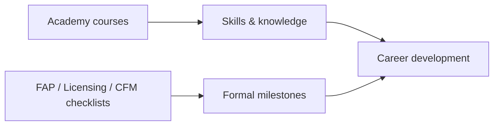
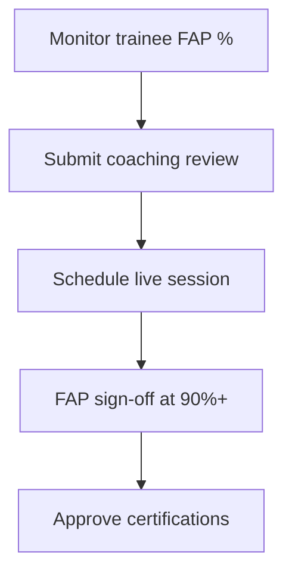

# EFGTrack — Training Academy Module
**User Guide**

**Version:** 1.1  
**Last updated:** June 2026  
**Audience:** Associates, new recruits, CFMs, trainers, team leaders, and agency owners  
**Hub URL:** `/training` (sidebar: **Training** / **EFGTrack Academy**)

---

## How to use this guide

| If you want to… | Start here |
|---|---|
| Understand the academy | [Section 1](#1-what-this-module-does) |
| Start learning today | [Quick start](#quick-start) |
| Complete a course | [Courses and lessons](#6-courses-and-the-course-player) |
| See what's assigned to you | [Assignments](#9-assignments) |
| Coach trainees (CFM) | [FAP & Coaching Center](#13-fap-coaching-center) |
| Build content (trainer) | [Training Content Studio](#17-training-content-studio-administrators) |
| Fix a problem | [Troubleshooting](#22-troubleshooting) |

---

## Table of contents

**Part 1 — Overview**

1. [What this module does](#1-what-this-module-does)
2. [Who can access what](#2-who-can-access-what)
3. [Module map — pages and URLs](#3-module-map-pages-and-urls)
4. [Academy vs program checklists](#4-academy-vs-program-checklists)

**Part 2 — Learning (members)**

5. [Quick start](#quick-start)
6. [Training Center hub](#5-training-center-hub-training)
7. [Courses and the course player](#6-courses-and-the-course-player)
8. [Lessons](#7-lessons)
9. [Assessments](#8-assessments)
10. [Assignments](#9-assignments)
11. [Learning paths](#10-learning-paths)
12. [My Learning Plan](#11-my-learning-plan)
13. [Certifications](#12-certifications)
14. [Achievements and leaderboard](#15-achievements-and-leaderboard)

**Part 3 — Coaching and live training**

15. [FAP & Coaching Center](#13-fap-coaching-center)
16. [Live training sessions and calendar](#14-live-training-sessions-and-calendar)

**Part 4 — Leaders, trainers, and reference**

17. [Training reports and analytics](#16-training-reports-and-analytics)
18. [Training Content Studio](#17-training-content-studio-administrators)
19. [Connections to other programs](#18-connections-to-other-efgtrack-programs)
20. [Key concepts](#19-key-concepts)
21. [Academy points and badges](#20-academy-points-and-badges)
22. [Tips and best practices](#21-tips-and-best-practices)
23. [Troubleshooting](#22-troubleshooting)
24. [Appendix](#23-appendix)

---

# Part 1 — Overview

## 1. What this module does

**EFGTrack Academy** is your central place to learn, practice, certify, and grow. It combines self-paced courses, learning paths, live coaching, certifications, and progress tracking tied to FAP, licensing, CFM training, and rank advancement.

| Capability | What it means for you |
|---|---|
| **Course catalog** | Video, document, and interactive lessons by topic |
| **Learning paths** | Role-based programs (New Associate, Licensing, CFM Certification) |
| **Assignments** | Courses assigned by leaders, often with due dates |
| **Assessments** | Scored quizzes linked to courses |
| **Certifications** | Academy certificates, sometimes with mentor approval |
| **FAP & Coaching** | Apprenticeship progress, CFM feedback, sessions |
| **Live sessions** | Webinars and coaching labs on your calendar |
| **My Learning Plan** | Smart recommendations by role and progress |
| **Achievements** | Points, badges, streaks, leaderboard |
| **Reports** | Personal or team training analytics |

> **Academy vs checklists:** Academy courses build **skills**. Checklists (FAP, Licensing, CFM Training) track **formal program milestones**. The dashboard links both.

---

## 2. Who can access what

### Everyone (typical member)

Training Center · catalog · lessons · assessments · assignments · paths · learning plan · certifications · achievements · personal reports · live session registration

### Leaders and mentors

| Capability | Who |
|---|---|
| Training reports — **direct reports** | Team leaders, CFMs (`view own team`) |
| Training reports — **full downline** | Leaders with `view training summary` |
| Certification approval | Active CFM mentor assignment |
| FAP sign-off and coaching reviews | CFMs |

### Trainers and administrators

| Capability | Requires |
|---|---|
| Training Content Studio | `manage training` |
| Assign courses | `manage training` |
| Organization reports | `manage training` |
| Build assessments | `manage assessments` |
| Training calendar | `manage training calendar` |

Permission names: [Appendix J](#j-permission-reference).

---

## 3. Module map — pages and URLs

### Member pages

| Page | URL | Purpose |
|---|---|---|
| **Training Center** | `/training` | Dashboard, catalog, shortcuts |
| **Course outline** | `/training/courses/{slug}` | Lessons, progress, assessment link |
| **Lesson player** | `/training/courses/{slug}/lessons/{id}` | Content + mark complete |
| **Assessments** | `/assessments` | All knowledge checks |
| **Take assessment** | `/assessments/{id}/take` | Submit answers |
| **My assignments** | `/training/assignments` | Assigned courses |
| **Learning paths** | `/training/paths` | Structured programs |
| **My Learning Plan** | `/training/plan` | Personalized priorities |
| **My certifications** | `/training/certifications` | Earned and pending |
| **FAP & Coaching** | `/training/coaching` | FAP progress, CFM feedback |
| **Live sessions** | `/training/sessions` | Register for events |
| **Achievements** | `/training/achievements` | Points, badges, leaderboard |
| **Training reports** | `/training/reports` | Analytics, PDF, email |

### Administrator pages (`manage training`)

| Page | URL |
|---|---|
| Content Studio | `/admin/training` |
| Course Builder | `/admin/training/courses` |
| Path Builder | `/admin/training/paths` |
| Assign courses | `/training/assignments/manage` |

### Related program trackers

| Program | URL |
|---|---|
| FAP checklist | `/field-apprenticeship` |
| CFM training | `/cfm-training` |
| Licensing | `/licensing` |
| Rank advancement | `/rank-advancement` |

---

## 4. Academy vs program checklists

| Tracker | What it measures |
|---|---|
| **Academy** | Lessons, assessments, certifications, points |
| **FAP** (`/field-apprenticeship`) | Field apprenticeship checklist |
| **Licensing** (`/licensing`) | State/provincial licensing steps |
| **CFM Training** (`/cfm-training`) | Mentor certification checklist |

All four appear on the Training Center dashboard under **Program Trackers**.

---

# Part 2 — Learning (members)

## Quick start

**Goal:** Complete your first course this week.

1. Open **Training** → review dashboard cards
2. Go to **My Learning Plan** — work the **top priority** first
3. If new: enroll in **New Associate Path** when suggested
4. Open first course → complete lessons → **Mark complete** each one
5. Pass the linked **assessment** when lessons are done
6. Check **Achievements** — build a daily learning streak

---

## 5. Training Center hub (`/training`)

### Summary cards (8)

| Card | Meaning |
|---|---|
| Courses Assigned | Active assignments not completed |
| Courses Completed | All lessons finished |
| Certifications Earned | Issued certificates |
| In Progress | Lessons + path enrollments in progress |
| Overdue Training | Past due date |
| Training Hours | Estimated from lesson time |
| FAP Completion | FAP checklist % |
| Licensing Progress | Licensing checklist % |

### Below the cards

- **Gamification strip** — points, streak, badges, leaderboard rank
- **Learning activity chart** — 6-month started vs completed
- **Recommended for you** — up to 5 personalized actions
- **Learning paths preview** · **Featured courses** · **Program trackers**
- **My assignments** · **My certifications** · **Full course catalog**

---

## 6. Courses and the course player

### Course outline shows

Title, description, category, type, difficulty, duration, tags (**Sequential** / **Drip**), progress %

### Lesson list

Number, title, type, status (Not started / In progress / Completed), **Locked** if not yet available

### Pacing modes

| Mode | Behavior |
|---|---|
| **Sequential** | Complete each lesson before the next unlocks |
| **Drip** | One lesson per day from start date |
| **Open** | No locks |

### When complete

Green **Course complete** panel. Sidebar shows linked **assessment** with passing score and **Take assessment** button.

---

## 7. Lessons

### Layout

Main content (video, document, article) · Previous/Next · Sidebar lesson list

### Actions

| Button | Effect |
|---|---|
| **Mark complete** | Updates progress, may unlock next lesson, awards points |
| **Reopen lesson** | Review without losing credit |
| **Open resource** | External link in new tab (document lessons) |

Locked lessons show why: *Complete previous lesson* or *Unlocks [date]*.

---

## 8. Assessments

### Before starting

| Rule | Typical value |
|---|---|
| Passing score | 70–80% |
| Max attempts | 3 |
| Prerequisite | All course lessons complete |

### Taking an assessment

1. **Start assessment** (or **Retake**)
2. Answer questions (multiple choice or short answer)
3. **Submit** → immediate score and pass/fail

After passing: retakes disabled by default; may trigger certification eligibility.

### Blocked?

| Message | Fix |
|---|---|
| Complete all lessons | Finish remaining lessons |
| Already passed | No action needed |
| No attempts left | Contact trainer or CFM |

---

## 9. Assignments

**URL:** `/training/assignments`

Leaders assign courses with optional due date and notes.

| Column | Meaning |
|---|---|
| Status | Assigned, in progress, completed, overdue, cancelled |
| Due date | Highlighted red when overdue |
| Progress | Bar updates as you complete lessons |

Completing all lessons (+ assessment if required) auto-marks assignment **completed**.

**Assign courses** (`manage training`): select member → course → due date → notes → **Assign**.

---

## 10. Learning paths

Structured programs grouping multiple courses.

### Default paths

| Path | Audience | Focus |
|---|---|---|
| New Associate | Associate | Compliance, FNA, prospecting, FAP readiness |
| Licensing | Associate | Exam prep, CE, provincial requirements |
| CFM Certification | Mentor | Coaching, leadership, mentorship |
| Agency Owner | Leader | Recruiting, retention, compliance |

### Path workflow

1. Browse `/training/paths` → open path
2. **Enroll in path** → track progress
3. **Continue next course** jumps to next incomplete course
4. 100% on all required courses → path **completed** (+ points and Path Graduate badge)

---

## 11. My Learning Plan

**URL:** `/training/plan`

Personalized priority list from role, enrollments, assignments, checklists, and activity.

### Recommendation types

| Type | When it appears |
|---|---|
| Overdue assignment | Past due date |
| Continue learning | Course in progress |
| Learning path | Next course in enrolled path |
| Assessment ready | Lessons done; quiz available |
| FAP / Licensing / CFM | Checklist behind pace |
| Get back on track | No activity 14+ days |
| On track | Positive confirmation |

**Dismiss** hides a suggestion until circumstances change.

---

## 12. Certifications

**URL:** `/training/certifications`

| Status | Meaning |
|---|---|
| Pending | Awaiting mentor/trainer approval |
| Issued | Certificate granted — includes number |
| Rejected | Not approved — follow up with mentor |

### Typical earn flow

1. Complete course + all lessons
2. Pass assessment
3. Auto-issued **or** **pending** for mentor review
4. CFM/trainer approves at **Review requests** (`/training/certifications/reviews`)

---

## 15. Achievements and leaderboard

**URL:** `/training/achievements`

| Stat | Description |
|---|---|
| Academy Points | Total from all learning activities |
| Current / Best Streak | Consecutive days with lesson completion |
| Badges Earned | Count collected |
| Leaderboard Rank | Organization or team position |

### Default point values

| Activity | Points |
|---|---|
| Lesson completed | 1 |
| Course completed | 10 |
| Assessment passed | 15 |
| Certification issued | 25 |
| Session attended | 5 |
| Path completed | 20 |

Toggle leaderboard: **All** (organization) vs **My Team**.

---

# Part 3 — Coaching and live training

## 13. FAP & Coaching Center

**URL:** `/training/coaching`

### For trainees

- **My FAP Progress** — checklist % + link to `/field-apprenticeship`
- **Your CFM** — assigned mentor contact
- **Coaching feedback** — session and observation reviews from CFM

### For CFMs

| Action | Steps |
|---|---|
| **Coaching review** | Select trainee → type (Session / Field Observation) → score → feedback → Submit |
| **Schedule session** | Title, type, date/time, capacity, description → syncs to calendar |
| **FAP sign-off** | When trainee ≥ 90% — formal completion approval |

---

## 14. Live training sessions and calendar

**URL:** `/training/sessions`

| Session type | Typical use |
|---|---|
| Live Coaching | Interactive CFM/trainer session |
| Webinar | Group presentation |
| Field Training | Field observation debrief |

**Register** → event added to `/calendar`. **Check in** on session day for attendance points.

Instructors: **Mark attended** on roster for registered trainees.

---

# Part 4 — Leaders, trainers, and reference

## 16. Training reports and analytics

**URL:** `/training/reports`

| Scope | Who | Covers |
|---|---|---|
| Personal | Everyone | Your data only |
| Direct reports | `view own team` | Immediate team |
| Downline | `view training summary` | Full hierarchy |
| Organization | `manage training` | Agency-wide |

**Download PDF** or **Email report**. Metrics: lessons/courses completed, assessments passed, certifications, hours, overdue assignments, trends.

---

## 17. Training Content Studio (administrators)

**URL:** `/admin/training` — requires `manage training`

| Tool | Purpose |
|---|---|
| Course Builder | Create courses and lessons |
| Path Builder | Assemble paths from published courses |
| Assign Training | Assign to members |
| Assessments | Build via Admin Management |

### Publishing checklist

1. Clear title, description, category
2. All lessons have content (video, text, or links)
3. Sequential/drip settings match design
4. Mark **Published**
5. Link and test assessment
6. Add to learning path
7. **Preview Training Center** as a member
8. Pilot assign before agency-wide rollout

### Key course settings

Published · Featured · Sequential required · Drip enabled (one lesson/day)

Only **published** courses appear in catalog and paths.

---

## 18. Connections to other programs

| Module | Connection |
|---|---|
| **FAP** | Dashboard %; coaching sign-off; learning plan recommendations |
| **Licensing** | Dashboard %; recommendations when behind |
| **CFM Training** | Checklist at `/cfm-training` |
| **Rank advancement** | Training % may factor into rank requirements |
| [Goals & Performance](/support/documentation/goals-and-performance) | Goal metrics sync training/FAP progress |
| [FNA Management](/support/documentation/fna-management) | FNA courses in New Associate path |
| [Prospects](/support/documentation/prospect-sales-funnel) | Prospecting courses support CRM activity |
| **Calendar** | Live sessions sync to personal calendar |

---

## 19. Key concepts

| Term | Definition |
|---|---|
| **Course** | Collection of lessons; may include assessment and certification |
| **Published** | Visible to members |
| **Draft** | Admin-only in Content Studio |
| **Assignment** | Course allocated to a member with optional due date |
| **Learning path** | Ordered program of courses |
| **Sequential / Drip** | Lesson unlock rules |
| **Academy points** | Gamification currency |
| **Streak** | Consecutive days with completed lessons |

---

## 20. Academy points and badges

| Level | Meaning |
|---|---|
| Bronze | Early milestones |
| Silver | Intermediate |
| Gold | Advanced |
| Platinum | Major completion |
| Diamond | Elite recognition |

Example badges: First Course Completed · Assessment Ace (100%) · Path Graduate · 3/7/14-Day Streak · CFM Certified

See **Available Badges** on Achievements for your agency's full list.

---

## 21. Tips and best practices

**Learners**
- Start each week on **My Learning Plan**
- Mark lessons **complete** honestly — drives assignments and rank
- Build a **daily streak** — even one short lesson counts
- Register for **live sessions** early

**CFMs**
- Review trainee Learning Plan priorities in 1:1s
- Submit coaching reviews within **48 hours**
- **FAP sign-off** only when requirements are genuinely met
- Approve certifications promptly

**Trainers**
- Member-friendly titles — not internal jargon
- Test sequential/drip with a test account before publishing
- Run **monthly organization reports** for drop-off patterns

---

## 22. Troubleshooting

### Training menu missing

**Cause:** Account lacks dashboard access.  
**Fix:** Contact administrator.

### Course or path not visible

**Cause:** Draft or wrong audience.  
**Fix:** Only **published** content shows to members. Confirm path audience matches your role.

### Lesson locked

**Cause:** Sequential or drip rule.  
**Fix:** Complete prior lesson or wait for unlock date on course outline.

### Cannot take assessment

**Cause:** Incomplete lessons, no attempts, or already passed.  
**Fix:** Finish lessons; check attempts (max 3); passed assessments block retakes.

### Assignment still overdue after completion

**Cause:** Assessment not passed or page not refreshed.  
**Fix:** Pass required assessment; refresh. Contact assigner if stuck.

### Certification stuck on pending

**Cause:** Awaiting mentor approval.  
**Fix:** CFM approves at **Review requests**. Follow up after a few business days.

### Session not on calendar

**Cause:** Registration incomplete.  
**Fix:** Open session detail → **View in calendar**; check date range in Calendar.

### Permission denied (403)

See [Appendix J](#j-permission-reference).

### CFM Coaching shows no trainees

**Cause:** No active mentor assignment.  
**Fix:** Verify CFM assignment in agency management.

---

## 23. Appendix

### A. Default learning path codes

`new-associate` · `licensing` · `cfm-certification` · `agency-owner`

### B. Course types

Video · Document-Based · Interactive · Webinar Recording · Live Training · Certification Program · Coaching Program

### C. Lesson types

Video · Document · Article · Interactive · Quiz

### D. Coaching review types

Coaching Session · Field Observation · FAP Sign-Off

### E. Assignment statuses

Assigned · In progress · Completed · Overdue · Cancelled

### F. Certification statuses

Pending · Issued · Rejected

### G. Report scope quick reference

| Scope | Permission |
|---|---|
| Personal | (all members) |
| Direct reports | `view own team` |
| Downline | `view training summary` |
| Organization | `manage training` |

### H. Related guides

| Guide | Topic |
|---|---|
| [Goals & Performance](/support/documentation/goals-and-performance) | Training metrics in goals |
| [FNA Management](/support/documentation/fna-management) | FNA courses and CFM review |
| [Prospects & Sales Funnel](/support/documentation/prospect-sales-funnel) | Prospecting activity |
| [Help & Support](/support) | All guides |

### I. Sample seeded courses

Prospecting Fundamentals · Presentation Mastery · Leadership Essentials · Compliance Foundations

*(Your live catalog depends on what administrators have published.)*

### J. Permission reference

| Permission | Allows |
|---|---|
| `manage training` | Content Studio, assign, org reports |
| `manage assessments` | Build assessments |
| `manage training calendar` | Schedule training events |
| `view own team` | Direct-report training reports |
| `view training summary` | Full downline training reports |

---

*Questions? **Help & Support** → **Browse documentation** or `/support`.*
